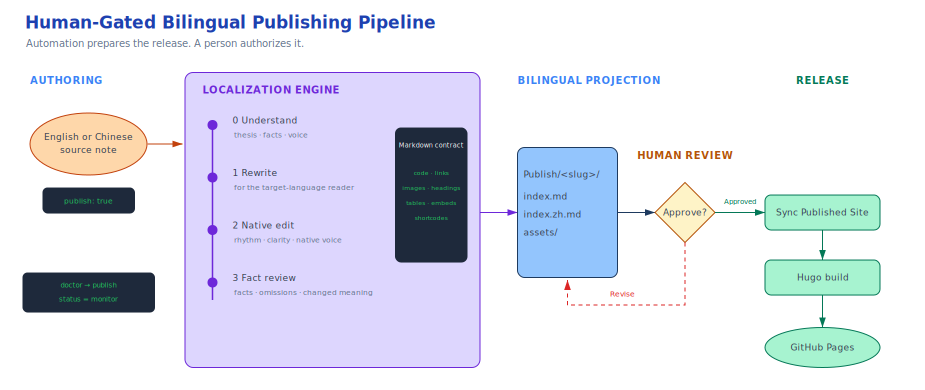

在[用 Obsidian、Hugo 和 GitHub Pages 搭建从私有到公开的发布流程](https://yanqian.github.io/posts/publish/building-a-personal-blog-with-obsidian-hugo-and-github-pages/)一文中，我介绍了如何划清边界，将私有知识库与公开网站分开。

那套方案解决了文章存放在哪里的问题，却没有回答同一篇文章该如何以两种语言发布。

起初，我以为双语发布无非是翻译：把 Markdown 交给模型，让它生成中文或英文，再把结果存到原文旁边。真正动手之后，我才发现，翻译反而是整件事中最不需要操心的部分。

真正棘手的是一系列架构问题：

- 哪个版本才是唯一准绳？
- 改写正文时，怎样确保代码块、链接、图片和 Hugo 元数据完好无损？
- 面对耗时很长的任务，怎样判断它仍在运行、已经失败，还是根本没有启动？
- 谁有权把生成的草稿移入公开网站？

我最终搭建的系统没有把本地化做成一个翻译按钮，而是将它纳入一条受控的发布流水线。

核心规则很简单：

> 文章在 Obsidian 中写作，发布器代码在 Hugo 仓库中维护。生成的草稿未经人工批准，绝不会进入网站。



---

## 原始文章始终是唯一准绳

一篇文章可以用英文起稿，也可以用简体中文起稿。发布器会识别源语言，再生成另一种语言的版本：

```text
英文原文 -> 中文本地化版本
中文原文 -> 英文本地化版本
```

Obsidian 中的原始笔记始终是唯一准绳。本地化文章只是由它派生的投影，并非另一份可以独立修改的原稿。

这一点至关重要。只要同时维护两份可编辑的主版本，内容很快就会出现偏差。修正后的日期可能只写进英文文章，没有同步到中文文章；重写后的结论也可能只出现在其中一种语言里，而另一种语言仍沿用旧论点。一旦两份文件都被视为原稿，此后的每次修改都会带来新的同步问题。

源笔记只需声明自己可以进入发布流程：

```yaml
publish: true
```

系列文章还会记录阅读顺序：

```yaml
series: Remote Agent Workflow
seriesOrder: 2
```

系统始终根据 `seriesOrder` 选择系列中的下一篇文章，绝不随机挑选。这条操作规则看似不起眼，却能防止自动化系统打乱叙事顺序，把内容本身没有问题的文章发错位置。

---

## 为什么一次翻译不够

如果让一个提示词包办所有工作，负担就太重了：它既要理解论点，又要用自然的目标语言写作；既要保留全部事实，又不能破坏 Markdown。把这些要求混在一起，结果可能流畅却不准确，也可能忠于原文却满是翻译腔。

因此，我把整个过程拆成四个阶段。

### 0. 理解文章

第一遍不翻译，只提取文章的核心主张、目标读者、推理链条、事实、术语、语气和结构性内容。

这样一来，后续阶段便有了一张语义地图，不必一边猜测作者的意图，一边组织目标语言的句子。

### 1. 按目标语言重写

第二遍面向目标语言的母语读者重新写作。文章表达的仍是同一组思想，但不再逐句追随原文。

这个区别很重要。英文和中文在重点安排、主语选择、段落衔接和行文节奏上并不相同。好的本地化文章，应该让人觉得作者原本就是用这种语言思考并写作的。

### 2. 以母语者的方式编辑

第三遍只处理可读性问题，包括节奏、词语搭配、句子如何推进，以及文中是否还残留源语言的语法痕迹。

编辑可以让文章更顺畅，却不能添加观点、删去限定条件，也不能调整文章结构。这个阶段的权限是我有意收窄的。

### 3. 审查事实一致性

最后一个模型阶段会逐节对照本地化草稿与作为唯一准绳的原文，检查有无遗漏或新增内容，推理和结论是否一致，以及姓名、日期、数字和技术术语是否准确。

审查者无权“把文章写得更好”。它只能对受影响的最小片段作出修改；如果无法通过局部修改安全修正，就必须让整个任务失败。

这种分工形成了一套有益的制衡机制：

```text
重写，使表达符合母语习惯
        +
编辑，使行文符合母语阅读习惯
        +
对照原文审查事实
```

语言是否自然，事实是否忠实，是两个不同的质量维度。这条流水线分别设置了独立阶段来把关。

当前默认模型是 `gpt-5.6-sol`。如果某篇文章需要不同的取舍，源笔记可以为任意阶段单独指定模型：

```yaml
understandModel:
rewriteModel:
editorModel:
reviewModel:
```

把这些选择写进 frontmatter，例外配置就会直接呈现在文章旁边，而不会藏在某台机器独有的插件设置中。

---

## Markdown 是必须履行的约定，不只是文本

文章不只有正文，还包含许多模型无权随意改动的结构。

每个生成阶段结束后，发布器都会检查：

- 标题层级
- 围栏代码块
- 图片目标地址
- 链接目标地址
- Obsidian 双链目标与嵌入
- 脚注标识符
- 表格尺寸
- Hugo shortcode

系统会根据围栏代码块标注的语言区别处理：

- `text` 围栏中是自然语言，应当本地化。
- `js`、`sh`、`bash`、`json` 或其他代码围栏中的内容必须逐字节保持不变。
- `# On the Mac` 这样的 Shell 注释属于代码，不是 Markdown 标题。

最后一条规则源于一次真实故障。一篇长文在本地化过程中看似卡住了，实际却是验证器把 Shell 代码块里的注释误判成了文章标题。接下来的检查又把 `SSH`、`Tailscale` 和 `tmux` 等词当成未翻译的英文标题，因此拒绝放行。

此外，所有模型阶段都会收到同一套术语约定。例如：

```json
{
  "source": "control plane",
  "target": "控制面",
  "avoid": ["控制平面"]
}
```

重写、编辑和事实审查遵循的是同一套规则。最后，系统仍会执行确定性检查：只要首选术语缺失，或禁用的变体依然存在，流水线就会停止。

提示词负责引导行为，验证器负责守住不变量。两者缺一不可。

---

## 发布器应该和网站代码放在一起

最初，发布器只放在我的 Obsidian 库里。用起来方便，却难以规范管理。

它既没有可靠的版本历史，也不受 CI 保护。我甚至无法简单地确认：Obsidian 中安装的 QuickAdd 脚本，究竟是不是我以为自己正在测试的那份代码。即使重新加载插件，内存中仍可能残留旧版用户脚本模块。

现在，发布器的权威版本放在 Hugo 仓库中：

```text
tools/obsidian-publisher/
├── publish-note.js
├── terminology.json
├── prompts/
├── tests/
└── bin/
    ├── publish-note
    └── install
```

运行时、提示词、术语表、安装程序、测试和运维手册全都纳入仓库管理。Obsidian 只接收安装到 `Scripts/` 下的副本。

每次运行前，启动器都会核对已安装运行时、所有提示词和术语文件的哈希值，确认它们与仓库中的权威版本一致。启动器还会检查必要工具是否齐全，并确认 GitHub Publisher 的定时同步已经关闭。

这样一来，各部分的职责便一目了然：

| 位置 | 职责 |
| --- | --- |
| Obsidian 源笔记 | 保存作为唯一准绳的正文和文章元数据 |
| Obsidian `Publish/` | 保存等待审核的双语草稿 |
| Hugo 仓库 `tools/` | 保存有版本记录的发布器实现与测试 |
| Hugo `content/posts/Publish/` | 保存从 Obsidian 同步过来的已批准内容 |
| GitHub Pages | 托管构建后的公开网站 |

写作者的工作区继续服务于写作，软件仓库则承担工程规范与约束。

---

## 生成草稿不等于发布

这是整个系统中最重要的一条边界：

> `Publish Note` 只负责生成草稿，并不授予发布许可。

该命令会在 Obsidian 库中创建一组对应文件：

```text
Publish/<slug>/
├── index.md
├── index.zh.md
└── assets/
```

两份文档共用同一个 `translationKey`，Hugo 据此关联英文页面与中文页面。

流程到这里就会停下。我会检查目标语言草稿是否自然、术语是否准确、标题是否合适、内容有无遗漏或误解，以及系列顺序是否正确。

只有当我明确说出“publish”之后，独立的 `Sync Published Site` 工作流才能运行。

GitHub Publisher 的配置也遵循这一原则：

```json
{
  "selectedPaths": ["Publish"],
  "publishTags": [],
  "syncInterval": 0
}
```

这些配置值划清了三条边界：

- 只有生成到 `Publish/` 中的投影可以离开 Obsidian 库。
- 标签不能误选库中其他位置的源笔记。
- 定时器不能绕过人工审核。

最后一项限制同样源于一次真实故障：我明明没有批准任何草稿，却还是出现了延迟执行的同步提交。原因在于插件的同步间隔并未归零。关闭定时同步不只是为了方便，更是为了把人工授权真正落实到系统架构中。

---

## 一篇文章的发布流程

标准流程从 Hugo 仓库中的预检开始：

```sh
tools/obsidian-publisher/bin/publish-note doctor
```

然后，我只启动一次本地化任务：

```sh
tools/obsidian-publisher/bin/publish-note publish
```

启动器会解析实际的 QuickAdd 命令 ID，检查当前笔记和 `publish: true`，执行命令，并等待结构化的状态变化。它不会调用 `obsidian://quickadd` URL，因为把 Obsidian 切到前台，并不能证明命令确实执行了。

可以用下面的命令查看进度：

```sh
tools/obsidian-publisher/bin/publish-note status
```

双语文件生成后，我会在 Obsidian 中逐一检查。工作流会停在这里，等待明确的人工批准。

批准后，`Sync Published Site` 会把这份投影复制到：

```text
content/posts/Publish/<slug>/
```

我会查看远程提交中的文件列表，确认其中只有刚刚批准的文章。随后，我从仓库统一的验证入口运行发布器测试、网站测试、Python 语法检查和 Hugo 生产构建：

```sh
./init.sh
```

推送到 `main` 后，GitHub Actions 会被触发，将网站部署到 GitHub Pages。

我刻意没有把这套流程做成一键发布。操作可以顺畅，但中间必须保留一次真正有意义的停顿。

---

## 长文章需要可观察、可恢复的运行机制

促使我形成这套设计的那次故障，前后大约花了 47 分钟才查清。大部分时间并未花在模型处理上，而是在不知道任务究竟有没有运行的情况下干等。

现在，系统会明确区分三种状态：

```text
status=running + 有效的新锁
    -> 等待；不要启动另一个任务

status=failed
    -> 查看错误，修复原因，再从已完成的缓存继续

锁已存在超过 30 分钟
    -> 确认没有请求仍在运行，然后执行 publish-note recover
```

每个 AI 请求都有五分钟的逻辑超时。长文章会按二级标题拆分。已经完成的编辑与审查分块会写入缓存，重试时不必重做已经成功的部分。

这彻底改变了我的操作方式。我不再根据等待时长猜测任务状态，而是直接查询系统掌握的信息。我也不再在重新加载插件后盲目重试，而是先判断任务仍在运行、已经失败、锁已过期，还是可以恢复。

自动化系统只有清楚暴露自身的不确定性，才值得信任。

---

## 这条流水线真正保护的是什么

最初的发布流程保护的是我的私有知识系统与公开网络之间的边界。

双语发布流程又增加了三条边界：

1. **原文与派生版本**——只有一篇文章是唯一准绳，再由它生成两种语言的对外投影。
2. **正文与结构**——模型可以改写语言，但受保护的 Markdown 必须保持稳定。
3. **生成与授权**——自动化可以准备待发布内容，但是否允许这些内容离开 Obsidian 库，必须由人决定。

我最在意的是最后一条。

AI 可以理解、重写、编辑和比对文章；测试可以发现结构损坏；缓存和锁可以让长任务具备恢复能力。但这些机制都无法替我判断：我是否已经读完文章，是否愿意署上自己的名字，将它公开发布。

因此，最终的系统没有追求完全自动化。这是我刻意保留的设计。

它自动完成昂贵而重复的劳动，同时把唯一应该留给人的决定保留下来：这篇文章是否已经准备好公开发布。
