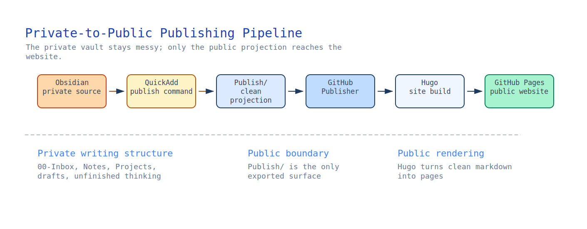
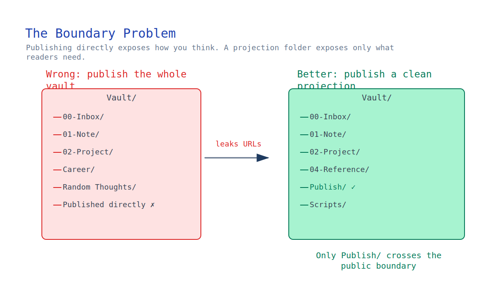
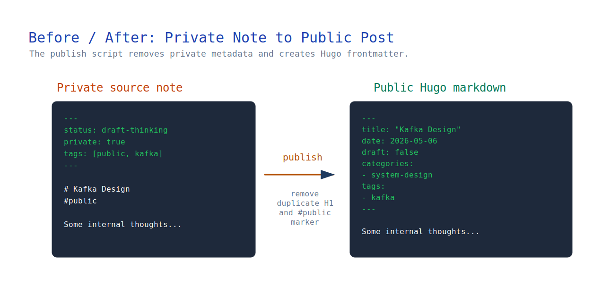

I recently rebuilt my personal website around a simple idea:

Keep Obsidian as the private source of truth, and selectively publish public notes into a clean personal website.

This is less a Hugo tutorial and more a note about designing a publishing boundary between a private knowledge base and a public website.

This article documents the architecture, tradeoffs, and workflow I ended up with.

The final stack is a private-to-public publishing pipeline:



The result:

- I can freely write notes inside Obsidian.
- My private folder structure is never exposed publicly.
- Public notes can be published with one command.
- GitHub Pages deploys automatically.

---

## Why I Did Not Want to Publish Directly from Obsidian

Many tutorials suggest publishing directly from the Obsidian vault.

I decided not to do this.

The problem is that my Obsidian vault is also my private knowledge system.

It contains things like:

```text
00-Inbox/
Projects/
Career/
Internal Notes/
Random Thoughts/
```

Publishing directly from the vault introduces a boundary problem:

- private structure leaks into public URLs
- internal note organization becomes public
- writing structure becomes constrained by publishing concerns

For example:

```text
00-Inbox/Kafka Design.md
```

might become:

```text
/posts/00-inbox/kafka-design/
```

I did not want my public site to reflect my internal thinking structure.

So I introduced an intermediate layer: `Publish/`.

This folder acts as a clean projection of public-ready content.



---

## Final Architecture

The final architecture separates writing structure from publishing structure.

That separation turned out to be the key design decision: my private vault can stay optimized for thinking, while the public website receives only clean, public-ready markdown.

---

## Step 1 — Create the Hugo Site

Install Hugo first.

Then create the site:

```bash
hugo new site yanqian.github.io
```

Enter the repo:

```bash
cd yanqian.github.io
```

Add the Coder theme:

```bash
git submodule add https://github.com/luizdepra/hugo-coder.git themes/hugo-coder
```

Update `hugo.toml`:

```toml
baseURL = "https://yanqian.github.io/"
languageCode = "en-us"
title = "Yan Qiang"
theme = "hugo-coder"
```

Run locally:

```bash
hugo server
```

---

## Step 2 — Deploy to GitHub Pages

Create the GitHub repo: `yanqian.github.io`.

Then enable:

`GitHub Pages → Source → GitHub Actions`

Use Hugo's official GitHub Actions workflow.

After that, every `git push` triggers GitHub Actions, builds the Hugo site, and deploys it to GitHub Pages.

---

## Step 3 — Design the Site Structure

I wanted the site to look more like a personal homepage than a traditional blog.

The final structure became `Home`, `Projects`, `About`, `Now`, and `Resume`.

Where:

- Home → public articles and writing
- Projects → project links
- About → profile
- Now → current focus/status
- Resume → resume information

Only the Home section changes frequently.

The other pages are mostly static.

---

## The Boundary Problem

At this point, Hugo worked.

But the real challenge was:

How do I publish selectively from Obsidian without exposing my vault structure?

I tried publishing by tag:

```yaml
tags:
  - public
```

This worked partially.

But GitHub Publisher preserved folder structure.

This caused:

```text
00-Inbox/Test.md
```

to become:

```text
content/posts/00-Inbox/Test.md
```

which I did not want.

The key issue was not Hugo itself. Hugo worked.

The real problem was deciding where the public/private boundary should live.


---

## Step 4 — Introduce a Publish Folder

I created `Publish/` inside my vault.

Only this folder is synchronized to GitHub.

This solved the boundary issue cleanly.

Now any note can be projected into the public pipeline without exposing where it originally lived inside the vault.


---

## Step 5 — Automate Publishing with QuickAdd

Manually copying files into `Publish/` was annoying.

So I added QuickAdd automation.

The publish script reads the current note, removes internal metadata, generates Hugo frontmatter, creates a slug, and writes the result into `Publish/`.

That gives me a simple workflow: write a note, run `Publish Note`, and let the website update automatically.



---

## Step 6 — Frontmatter Design

Published posts use Hugo-compatible frontmatter:

```yaml
---
title: "Kafka Design"
date: 2026-05-06
draft: false
categories:
  - system-design
tags:
  - kafka
  - distributed-systems
---
```

I use:

- categories for high-level structure
- tags for flexible indexing

---

## Categories vs Tags

I ended up treating them differently.

### Categories

Used for major site structure:

```yaml
categories:
  - backend
  - platform
  - system-design
```

Stable and limited.

### Tags

Used for detailed topics:

```yaml
tags:
  - kafka
  - redis
  - flink
  - reliability
```

Flexible and expandable.

---

## Step 7 — Avoid Duplicate Titles

One subtle issue appeared.

Originally my notes looked like:

```markdown
# Kafka Design

```

But Hugo already renders:

- title
- tags

from frontmatter.

This caused duplicate content.

I fixed this by cleaning the generated markdown:

- remove duplicated H1
- remove standalone `#public`
- keep only actual article content

---

## Lessons Learned

The biggest lesson was:

Publishing architecture matters.

A personal website is not only a frontend problem.

It is also a content pipeline problem.

The important separation became private thinking, public projection, and website rendering.

That is very different from treating the entire private vault as something to publish.

---

## Final Result

The final system gives me:

- private Obsidian knowledge base
- clean public publishing pipeline
- automated deployment
- minimal friction writing workflow
- clear public/private boundaries

Most importantly:

my note-taking structure no longer depends on my publishing structure.

That turned out to be the key design decision.
