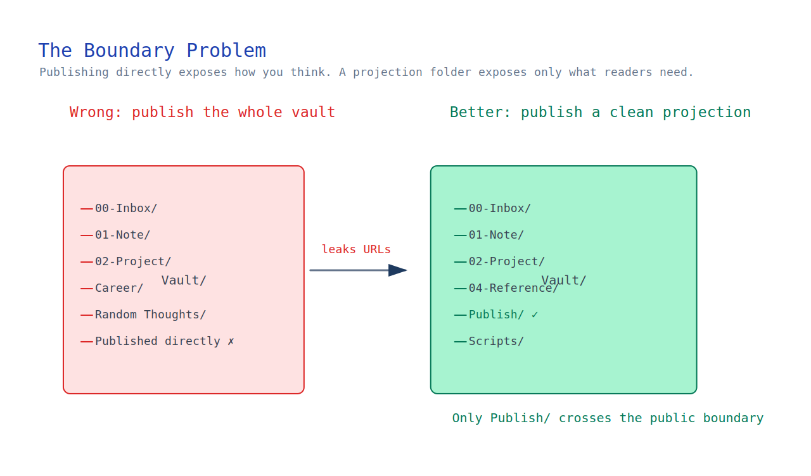
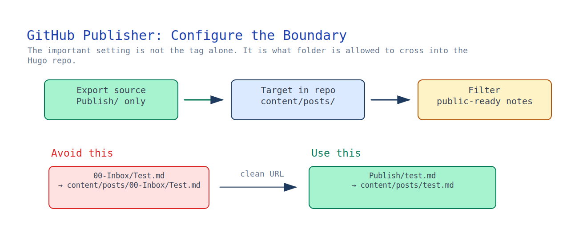
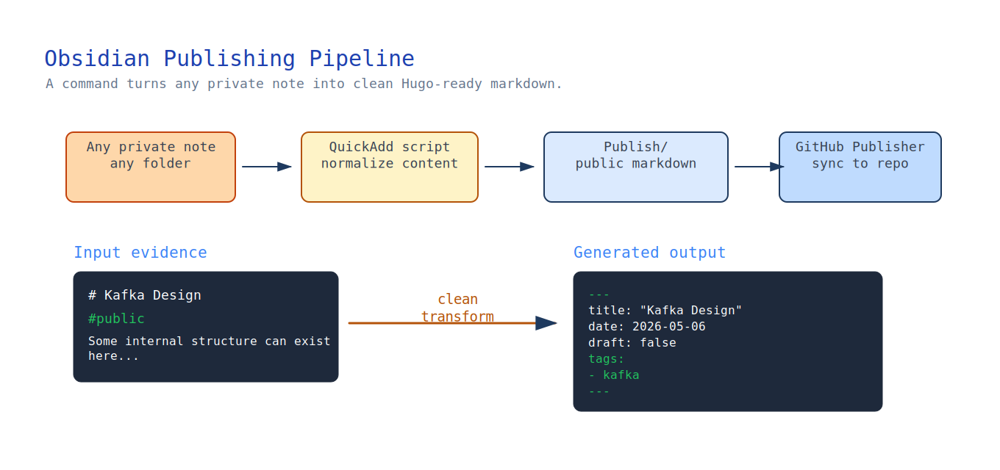
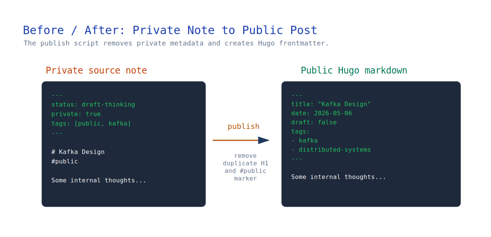

最近，我重新搭建了个人网站。出发点很简单：

继续把 Obsidian 作为私密内容的唯一可信来源，只从中挑选适合公开的笔记，发布到一个干净的个人网站上。

这篇文章与其说是 Hugo 教程，不如说是在讨论一个问题：私密知识库与公开网站之间的发布边界，究竟该怎么划定。

下面记录的是我最终采用的架构、做过的取舍，以及实际的发布流程。

文中的仓库名、URL 和网站页面都来自我自己的配置。如果你也想采用这套方案，请换成自己的 GitHub 用户名、仓库名、域名和导航结构。

最终，我搭出了一条从私密内容通往公开网站的发布管线：


它实现了这些效果：

- 我仍然可以在 Obsidian 里自由地写笔记。
- 私密目录结构永远不会暴露在公开网站上。
- 公开笔记可以用一条命令发布。
- GitHub Pages 会自动完成部署。

---

## 为什么我没有直接从 Obsidian 发布

很多教程都建议直接发布 Obsidian 仓库里的内容。

但我没有这么做。

因为我的 Obsidian 仓库不只是写作空间，还是我的私密知识系统。

里面有这样的目录：

```text
00-Inbox/
Projects/
Career/
内部笔记/
随想/
```

如果直接从仓库发布，就会带来边界问题：

- 私密目录结构会出现在公开 URL 中
- 内部笔记的组织方式会随之暴露
- 写作时还要顾及发布要求，反过来限制笔记的组织方式

比如这篇笔记：

```text
00-Inbox/Kafka 设计.md
```

最终可能对应这样的公开路径：

```text
/posts/00-inbox/kafka-design/
```

我不希望公开网站照搬自己梳理思路时使用的内部结构。

因此，我加了一层中间边界：`Publish/`。

这个目录是可公开内容的一份干净投影。



---

## 最终架构

最终的架构将写作结构与发布结构分开了。

事实证明，这是整套方案中最关键的设计决定：私密仓库仍然可以围绕思考与整理来组织，公开网站接收到的则只有干净、适合发布的 Markdown。

---

## 第 1 步 — 创建 Hugo 网站

先安装 Hugo。

然后创建网站：

```bash
hugo new site yanqian.github.io
```

进入仓库目录：

```bash
cd yanqian.github.io
```

添加 Coder 主题：

```bash
git submodule add https://github.com/luizdepra/hugo-coder.git themes/hugo-coder
```

更新 `hugo.toml`：

```toml
baseURL = "https://yanqian.github.io/"
languageCode = "en-us"
title = "Armstrong Yan"
theme = "hugo-coder"
```

在本地运行：

```bash
hugo server
```

---

## 第 2 步 — 部署到 GitHub Pages

创建 GitHub 仓库：`yanqian.github.io`。

然后启用：

`GitHub Pages → Source → GitHub Actions`

这里使用 Hugo 官方提供的 GitHub Actions 工作流。

配置完成后，每次执行 `git push` 都会触发 GitHub Actions：先构建 Hugo 网站，再部署到 GitHub Pages。

---

## 第 3 步 — 设计网站结构

我希望它更像个人主页，而不是传统博客。

最终的网站结构包括 `Home`、`Projects`、`About`、`Now` 和 `Resume`。

各个页面分别用于展示：

- Home → 公开文章与写作内容
- Projects → 项目链接
- About → 个人介绍
- Now → 当前关注的事情或近况
- Resume → 简历信息

只有 Home 会频繁更新。

其他页面大多是静态的。

---

## 边界问题

到这里，Hugo 已经可以正常工作了。

但真正棘手的问题才刚刚出现：

怎样才能只发布 Obsidian 中选定的笔记，又不暴露我的仓库结构？

我先尝试了按标签发布：

```yaml
tags:
  - public
```

这个办法只能解决一部分问题。

因为 GitHub Publisher 会保留原有的目录结构。

结果是：

```text
00-Inbox/Test.md
```

会变成：

```text
content/posts/00-Inbox/Test.md
```

这不是我想要的结果。

问题不在 Hugo。Hugo 本身运行得很好。

真正需要决定的是：公开与私密的边界，究竟应该划在哪里。



---

## 第 4 步 — 引入 Publish 目录

我在 Obsidian 仓库里创建了 `Publish/`。

只有这个目录会同步到 GitHub。

这样一来，边界问题就解决了，而且非常干净。

现在，无论一篇笔记原本放在仓库的哪个位置，我都可以为它生成一份公开版本，送入发布流程，而不暴露原始路径。



---

## 第 5 步 — 用 QuickAdd 自动完成发布准备

每次手动把文件复制到 `Publish/`，很麻烦。

于是，我用 QuickAdd 把这一步自动化了。

发布脚本会读取当前笔记，移除内部元数据，生成 Hugo frontmatter 和 slug，再将处理后的内容写入 `Publish/`。

我特意把整个过程分成两步：

1. 运行 `Publish Note`，在本地的 `Publish/` 中生成或更新公开版本。
2. 准备推送时，再运行 `Sync Published Site`，将 `Publish/` 目录同步到 GitHub。

这样一来，发布始终是一次明确的操作。我可以先在本地更新公开稿，检查生成的 Markdown 和复制过来的资源；只有确认文章可以公开后，才会触发 GitHub Publisher 同步。



---

## 第 6 步 — 设计 Frontmatter

公开文章使用与 Hugo 兼容的 frontmatter：

```yaml
---
title: "Kafka Design"
date: 2026-05-06
draft: false
tags:
  - kafka
  - distributed-systems
---
```

---

## 得到的经验

这次经历带给我最大的体会是：

发布架构很重要。

个人网站不只是前端问题。

它也是内容管线问题。

真正需要拆开的，是私下思考、公开投影和网站渲染这三个阶段。

这与把整个私密仓库都当作可发布内容，是两种完全不同的思路。

---

## 最终结果

最终，这套系统给了我：

- 私密的 Obsidian 知识库
- 干净的公开发布管线
- 自动化部署
- 尽可能顺畅的写作流程
- 清晰的公开与私密边界

最重要的是：

我的笔记结构不再受发布结构牵制。

事实证明，这才是整套方案最关键的设计决定。
