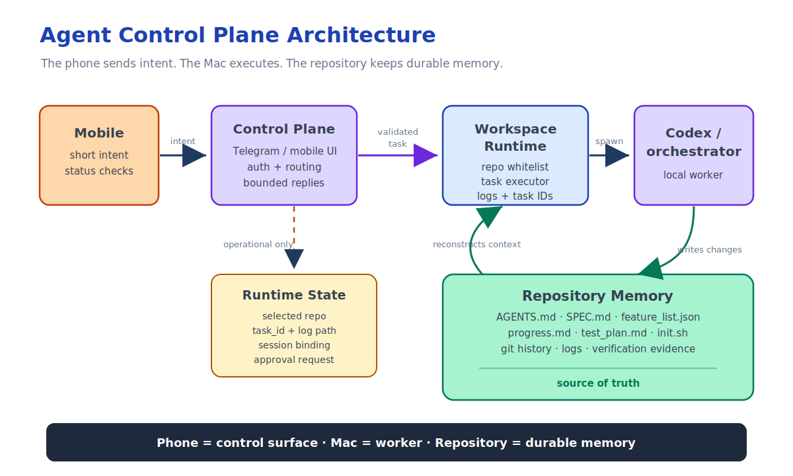

这是“远程智能体工作流”系列的第二篇。

上一篇文章里，我搭建了一套实用的远程终端工作流：

```text
手机 -> Tailscale -> SSH -> Mac -> tmux -> Codex
```

这套方案解决了第一个问题：离开书桌后，怎样连回自己的 Mac；手机断开后，怎样让本地智能体继续执行耗时较长的任务。

它很快就派上了用场。

但在实际使用后，我又发现了第二个问题。

SSH 解决了连通性，却不会自动带来一套好用的远程开发工作流。

移动端 SSH 用得越多，它的边界就越清楚：

> 手机不该被当成一台微型终端。  
> 手机应该成为本地智能体工作流的控制面。

## 第一层解决的是基础设施

远程终端这套配置仍然不可或缺。


我需要：

- 用 Tailscale 连接手机与 Mac，又不把 SSH 暴露在公网上。
- 用 SSH 安全登录。
- 用 tmux 保证耗时较长的任务不会因连接断开而终止。
- 用 caffeinate 防止 Mac 在智能体工作期间休眠。

这样，我就有了一套可靠的基础能力：

```text
我可以连上机器。
我可以启动工作。
我可以断开连接。
我可以稍后再连回来。
```

这是很实在的一步。

但它只回答了基础设施层面的问题：

```text
我能连到这台机器吗？
```

它没有回答工作流层面的问题：

```text
我能顺畅地用手机推动耗时较长的 AI 开发工作吗？
```

对我来说，答案是否定的。

## 手机并不是一台好终端

移动端 SSH 很适合应急访问。

但如果每天都用它操作编程智能体，体验并不好。

单看每个问题都不算严重，可一旦叠加，操作阻力很快就会变大：

- 在手机键盘上输入很长的提示词很别扭。
- Shell 的编辑快捷键用起来不顺手。
- 在 iOS 上使用 `Ctrl`、`Esc`、`Tab` 和方向键，本来就不自然。
- 屏幕太窄，很难快速浏览日志。
- 在不同任务之间切换很慢。
- 重新接入 tmux 会话也要多费几步。
- 恢复上下文仍然太依赖人的记忆。

问题其实不在 Termius、SSH 或 tmux。它们都做好了自己分内的事。

真正的问题在于抽象方式。

把手机当终端用，等于把它看作一台缩小版的笔记本电脑。这个思路并不合适。

手机擅长的是：

- 发出简短指令
- 查看状态
- 批准待处理的操作
- 阅读简洁的结果
- 停止或继续任务

手机不擅长的是：

- 输入很长的命令
- 管理进程树
- 滚动查看原始日志
- 重新梳理项目状态
- 手动协调多个智能体会话

所以下一步，不是给移动端 Shell 换一套更好看的主题。

而是换一种控制界面。

## 远程 Shell 与智能体工作流

远程 Shell 的意思是：

```text
我在远程直接操作这台电脑。
```

智能体工作流的意思是：

```text
我发出意图，由本地运行时负责执行。
```

这是两种不同的模式。

| 维度 | 远程 Shell | 智能体工作流 |
|---|---|---|
| 交互方式 | 命令 | 任务与意图 |
| 手机端体验 | 操作稍有不慎就容易出错 | 轻量 |
| 状态 | 当前 Shell 会话 | 仓库文件与日志 |
| 长时间运行 | tmux 会话 | 任务记录 |
| 恢复方式 | 手动恢复 | 根据仓库状态重建上下文 |
| 最适合的用途 | 紧急访问 | 日常远程开发 |

Shell 围绕命令运转。

智能体工作流则应该围绕任务运转。

在手机上，我不想手动输入：

```bash
cd ~/Project/my-repo
tmux attach -t codex
git status
python3 orchestrator.py --max-rounds 1
```

我更希望直接说：

```text
继续当前功能。先读取仓库状态，让编排器运行一轮，然后把结果发给我。
```

这条指令应该交给 Mac 上的本地运行时处理。

## 控制面模型

我想要的架构大致如下：



```text
移动客户端
  -> 控制面
  -> 工作区运行时
  -> Codex / 编排器
  -> 仓库状态 + 日志
```

手机只负责提供控制界面。

真正干活的仍然是 Mac。

这一点很重要，因为 Mac 上已经有：

- 本地代码仓库
- git 凭据
- 开发工具
- 环境变量
- 测试工具集
- Codex 或其他本地智能体
- 项目专用脚本

我不想把这些能力全部搬到手机上。

也不一定想把它们迁到云端。

我的目标其实更克制：

```text
执行留在本地。
控制方式适合手机。
```

## 控制面应该做什么

一个轻量的控制面不必亲自写代码。

它的职责，是为本地运行时提供一个更安全、更简单的远程入口。

例如，它可以提供这些命令：

```text
/repos
/use <repo>
/agent <instruction>
/agent new <instruction>
/agent resume <session_id> <instruction>
/agent session
/status
/logs <task_id>
/stop <task_id>
```

这些命令不是为了取代 Codex。

它们只是为 Codex 划出一道外围边界。

控制面应该负责：

- 验证身份与权限
- 选择代码仓库
- 校验工作区
- 创建任务
- 保存任务日志
- 维护任务状态
- 延续会话
- 转发审批请求
- 返回篇幅受控、适合手机阅读的结果

但它不应该接管整个开发过程。

不应该凭空定义功能状态。

不应该擅自改写项目规划文件。

也不应该把聊天记录当成项目数据库。

控制面只是远程入口，不是项目事实的依据。

## 持久状态应该留在仓库里

这成了最重要的原则：

> 聊天记录不是持久的项目状态。

对于耗时较长的智能体工作，无论发生以下哪种情况，项目都应该能够恢复：

- 手机断开连接
- 终端会话丢失
- Codex 对话线程发生变化
- 机器人重新启动
- 智能体被中断
- 几小时后我再回来继续工作

因此，真正需要长期保留的状态应该放在代码仓库中：

- `AGENTS.md`
- `SPEC.md`
- `feature_list.json`
- `progress.md`
- `test_plan.md`
- `init.sh`
- `orchestrator.py`
- git 历史记录

智能体应该能够根据这些文件重建上下文。

手机消息只需要给出下一步指令。

这样一来，人的角色也会随之改变。

我不必再手动推进 Shell 中的每一步，而可以直接发出一条更高层的指令：

```text
加入这项需求。先更新规格说明和功能列表，再通过编排器完成一轮功能开发并验证结果。
```

本地运行时应该知道怎样把这条指令落实为仓库中的实际变更。

## 这不只是自动化

我们很容易把这套做法称为自动化，但这个说法又不完全准确。

通常所说的自动化是：

```text
运行这个固定脚本。
```

远程智能体工作流则是：

```text
保留项目状态，委派下一个目标，验证结果，并在以后继续推进。
```

这些事不是一个脚本就能完成的。

它还需要：

- 一个受到约束的入口
- 一个已经选定的工作区
- 一条任务记录
- 一套可追溯的日志
- 可以恢复的仓库状态
- 一条验证命令
- 恢复或停止工作的方式

所以，移动端 SSH 只是第一层。

它让我能够访问那台机器。

但工作流本身仍然需要一套结构。

## 下一步

我正在搭建的下一层，是一个面向本地 Codex 工作流的 Telegram 控制面。

其中一个重要的设计选择，是采用轮询：

```text
本地 Mac 机器人 -> Telegram 服务器
```

而不是 webhook 模式：

```text
Telegram 服务器 -> 公网 HTTPS 端点
```

采用轮询后，即使 Mac 不具备以下任何一项，也能接收 Telegram 指令：

- 公网 IP
- 入站端口映射
- HTTPS 端点
- ngrok
- Cloudflare Tunnel

这与上一篇文章的思路一脉相承：

```text
不要把 Mac 直接暴露在公网之上。
让工作节点留在本地。
让控制界面可以从远端访问。
```

不过，真正关键的并不是 Telegram。

Telegram 只是移动客户端的一种选择。

更深一层的思路是：

```text
远程终端提供基础设施。
智能体控制面提供工作流。
仓库状态承担记忆。
```

这正是我希望这套远程 AI 开发环境继续演进的方向。
