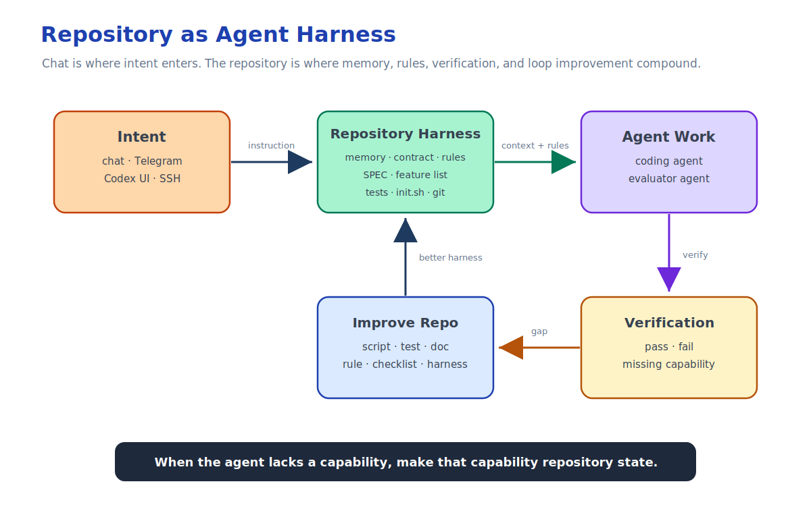

This is Part 4 of the Remote Agent Workflow series.

The first layer of my remote AI development setup was connectivity.

```text
Phone -> Tailscale -> SSH -> Mac -> tmux -> Codex
```

That let me reach my Mac from a phone and keep long-running local tasks alive.

The second layer was control.

```text
Phone -> Telegram Bot -> local Codex runtime -> selected repository
```

That made the phone a control surface instead of a tiny terminal.

But neither layer solved the deeper problem.

Remote access lets me reach the machine.

Remote control lets me start and inspect work.

Long-running agent development needs memory.

If an agent can run while I am away, resume after interruption, continue from another session, or be controlled through a phone, then the project cannot live inside one chat thread.

My rule became:

> The chat is for instructions.  
> The repository is for memory.

More precisely, the repository is not just where code lives. It is the agent's memory, operating contract, and feedback harness.



## Why Chat Is Not Project State

Chat is useful for intent.

It is a good place to describe a goal, ask a question, correct direction, or make a product decision.

But chat is a poor place to store durable project state.

It is hard to diff, hard to verify, tied to a thread, and easy for a later agent session to misread or miss entirely. It mixes ideas, logs, guesses, decisions, and outdated context in one stream.

For a small one-off change, this is fine.

For long-running agent work, it breaks down.

The project needs stable answers to questions like:

- What is the system supposed to do?
- What has already been implemented?
- What failed before?
- What proves this behavior still works?
- What should the next agent read before changing files?

Those answers should live with the code.

## The Repository as Memory and Harness

In my projects, durable agent state usually lives in files like:

- `AGENTS.md`
- `SPEC.md`
- `feature_list.json`
- `progress.md`
- `test_plan.md`
- `init.sh`
- `orchestrator.py`
- git history

The exact filenames are less important than the separation of responsibilities.

Each file gives the agent a different kind of memory:

```text
AGENTS.md          -> how agents should behave
SPEC.md            -> what the project is supposed to do
feature_list.json  -> what work exists and what state it is in
progress.md        -> what is currently true
test_plan.md       -> what proves completed work still works
init.sh            -> how to check project health
orchestrator.py    -> how to run bounded agent rounds
git history        -> what actually changed over time
```

This is not about adding ceremony.

It is about making agent work recoverable.

But the repository is not only memory.

It is also the harness around the agent.

This part of my workflow was influenced by a few ideas that point in the same direction. OpenAI's writing on harness engineering describes a shift where humans design environments, specify intent, and build feedback loops so agents can do reliable work. Anthropic's long-running harness work emphasizes structured handoff artifacts, decomposed chunks, and separate generator/evaluator roles. The Ralph loop idea adds the mindset that when the loop fails, you improve the loop.

That matches my experience.

If an agent fails because it lacks context, tooling, or verification, I do not want to fix only that single task by hand. I want to improve the repository so the next agent has a better environment.

That may mean adding:

- a script
- a test
- a contract check
- a manual verification checklist
- clearer `AGENTS.md` guidance
- better `progress.md` notes
- a more precise feature entry

The failure is a signal about the harness.

The better question is not only:

```text
How do I get this task done?
```

It is:

```text
What was missing from the environment that made this task hard for the agent?
```

## What Lives in the Repository

`AGENTS.md` is the operating contract: what to read first, what role the agent is playing, what it may change, how to verify work, and what not to rely on.

The most important rule is simple:

```text
Never rely on chat history.
Always rely on project state.
```

`SPEC.md` is where requirements survive the conversation: goal, scope, constraints, expected behavior, acceptance criteria, and exclusions.

`feature_list.json` turns the spec into executable work.

Each deliverable unit gets a stable ID and state. That lets the workflow say:

```text
Implement F043.
Evaluate F043.
Mark F043 done only after verification.
```

That is much more precise than:

```text
Continue the thing we discussed earlier.
```

`progress.md` is the handoff note: where are we right now?

`test_plan.md` records verification evidence.

If a feature is marked complete, the repository should say how it was verified.

`init.sh` is the boring health check. It gives both the human and the agent one shared answer to:

```text
Is this repository healthy enough to continue?
```

The exact commands vary by project. The principle does not.

## Verification Turns Memory into Rules

Agent work needs verification evidence.

Otherwise, "done" becomes a feeling.

In my Obsidian plugin project, some behavior can be tested automatically:

- build checks
- unit tests
- harness tests
- contract tests
- smoke checks

Some behavior still needs human-style verification inside Obsidian:

- open a disposable vault
- enable the plugin
- run a command from the command palette
- click `Next`
- confirm the expected memory appears
- inspect AI request behavior when AI is enabled

That does not mean the verification should stay informal.

Manual checks are still project state.

They should be written down as setup, action, and expected result.

The goal is to turn vague judgment into something the next agent can inspect, follow, or eventually automate.

## The Loop Should Improve Itself

In some projects, I use `orchestrator.py` to run bounded agent rounds.

The script can read project state, pick one unfinished feature, start a coding agent, start an evaluator agent, update feature state only after verification, and commit completed or blocked work.

But the orchestrator is not the memory layer.

It is the loop.

The memory still lives in repository files and git history.

The important part of the loop is not that it runs repeatedly.

The important part is that each failure can become a better rule, tool, or check.

If the agent cannot verify UI behavior, add a harness test, a Playwright check, a manual verification plan, or clearer expected behavior in the spec.

If the agent forgets an architectural rule, move the rule into `AGENTS.md`, a contract test, a lint check, or an error message that tells the next agent how to fix it.

If the agent cannot tell whether a feature is done, improve the feature entry, acceptance criteria, evaluator prompt, test plan, or health check.

The loop I want looks like this:

```text
agent attempts work
  -> verification finds a gap
  -> repo records the gap
  -> agent improves the harness
  -> next loop starts with a better environment
```

The goal is not full automation for its own sake.

The goal is to reduce hidden human rescue.

When the agent lacks a capability, I want that missing capability to become repository state.

## Runtime State vs Project State

Building the Telegram control plane made this distinction clearer.

The bot has runtime state:

- selected repository
- task ID
- log path
- Codex session binding
- approval request
- polling offset

That state is useful for operating the control plane.

But it is not project memory.

Project memory is different:

- requirements
- feature state
- progress
- verification evidence
- commits

The Telegram bot should not decide that a feature is complete.

It should not own the product spec.

It should not treat chat messages as the durable source of truth.

The bot only routes work into the selected repository.

The repository decides what the work means.

## What Changes About My Role

This workflow changes my role.

Instead of manually driving every command, I provide direction:

```text
Add this requirement.
Update the spec and feature list first.
Then run one verified implementation round.
Summarize what changed and what remains risky.
```

That instruction can come from my laptop, SSH, or Telegram on my phone. The interface is less important than the state model.

The agent should be able to reconstruct context from the repository before acting.

My job is to set goals, make product decisions, review results, and intervene when judgment is needed. The repository carries the memory between those moments.

## The Pattern

The pattern I keep returning to is:

```text
Chat is for intent.
Repo files are for memory.
Tests are for truth.
Git is for history.
The control plane is for routing.
The agent is for work.
```

SSH gives me access.

Telegram gives me mobile control.

Codex gives me an agent worker.

The repository gives the work somewhere to survive.

The more asynchronous the work becomes, the more important this rule becomes:

> In the repository, not in the chat.

## Sources

- [Harness engineering: leveraging Codex in an agent-first world](https://openai.com/index/harness-engineering/)
- [Harness design for long-running application development](https://www.anthropic.com/engineering/harness-design-long-running-apps)
- [Everything is a Ralph loop](https://ghuntley.com/loop/)

## Remote Agent Workflow Series

Series index: [Remote Agent Workflow](/posts/publish/remote-agent-workflow/)

Previous: [Remote Agent Workflow, Part 3: Turning Telegram into a Local Codex Control Plane](/posts/publish/turning-telegram-into-a-local-codex-control-plane/)  
Next: [Remote Agent Workflow, Part 5: What Still Matters After Codex Mobile](/posts/publish/what-still-matters-after-codex-mobile/)
