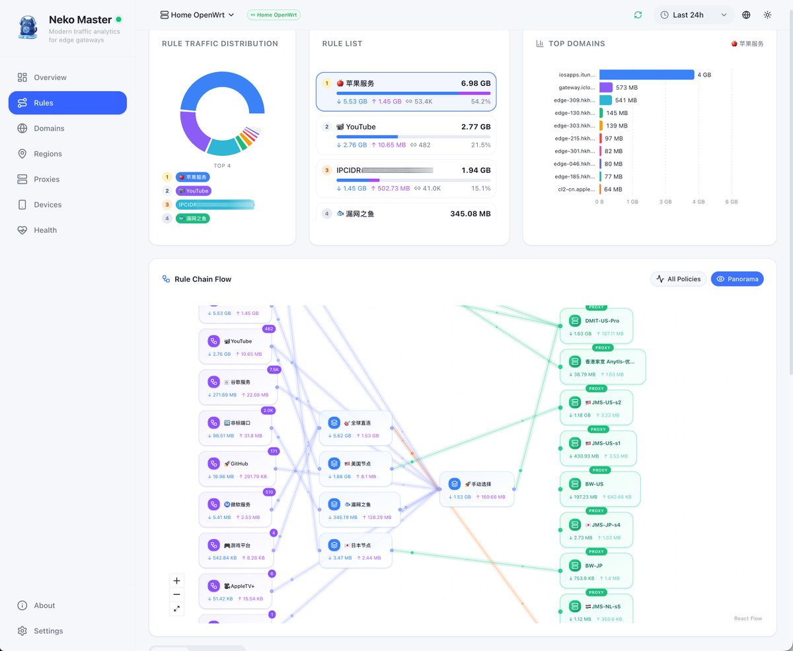
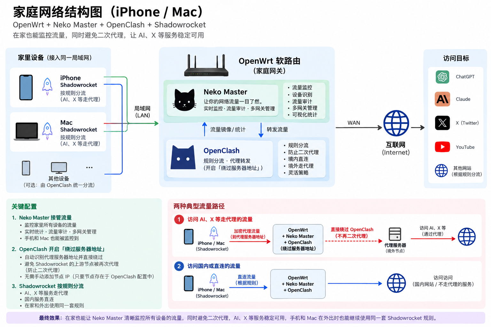

我最近在 X 上看到一张家庭网络拓扑图。



*图 1：原作者分享的 Neko Master 规则流量与 Rule Chain Flow 页面。来源：[@abskoop 发布的网络结构 X 原帖](https://x.com/abskoop/status/2095694206903652783?s=20)。*

图里有 Apple 服务、YouTube、GitHub，也有美国节点、日本节点、漏网之鱼，以及一排名字各异的代理服务器。乍一看，它像是一套复杂的家庭网络；但真正让我感兴趣的，不是作者买了哪台服务器，而是图里这些名词究竟是什么关系：

- 路由器本来就会路由，为什么还需要 OpenWrt？
- OpenWrt 已经提供 DNS 和防火墙，为什么还要安装 OpenClash？
- OpenClash 和 Mihomo 是什么关系？
- 已经有一台海外 VPS，为什么还需要 Trojan 或 Shadowsocks？
- VPS、VPN、代理节点和协议，到底是不是一回事？

这些问题最终都指向同一件事：

> 一条来自手机的网络连接，怎样被家庭路由器接管，经由一台海外服务器，抵达目标网站？

作者还发布了一张自己的家庭网络结构图，补充说明了这些组件在真实环境中的部署方式：



*图 2：原作者的家庭网络结构。iPhone 和 Mac 使用 Shadowrocket 分流，其他设备可由 OpenClash 统一处理。来源：[@abskoop 发布的 X 原帖](https://x.com/abskoop/status/2095711701609951477?s=20)。*

> [!info] 如何理解第二张图
> 这张图描述的是作者自己的部署，不是所有家庭网络的标准答案。图中的“OpenClash 绕过服务器地址”用于避免已经由 Shadowrocket 代理的连接再次进入 OpenClash；“Neko Master 接管流量”则应理解为采集和监控网关流量，而不是由 Neko Master 承担代理转发。

## 先把两种关系分开

第一张图展示流量最终匹配了哪些规则和节点，第二张图展示作者把组件部署在哪里。理解这套系统，首先要避免把“软件安装关系”“决策关系”和“数据经过的路径”画成同一条线。

软件的承载关系大致是：

```text
路由器硬件
  └─ OpenWrt：路由器操作系统
      └─ OpenClash：OpenWrt 上的代理集成与管理层
          └─ Mihomo：实际执行规则和代理协议的核心
```

一条被代理的网络连接，逻辑路径则是：

```text
手机或电脑
  -> 作为默认网关的 OpenWrt
  -> 路由器上的 Mihomo
  -> VPS 上运行的代理服务
  -> 目标网站
```

而在 Mihomo 内部，还会发生一条“决策路径”：

```text
连接元数据
  -> 分流规则
  -> 策略组
  -> 节点配置
```

规则、策略组和节点配置决定连接怎样发出，但它们不是三个真实的网络跳点。

## 路由器、驱动与 OpenWrt

一台家用路由器本质上是一台小型计算机，包含 CPU、内存、网卡和无线芯片，也需要内核、驱动和网络服务。驱动让操作系统控制硬件；DHCP、DNS、路由、防火墙和管理界面则由固件中的操作系统及其服务提供。

新路由器已经安装了厂商固件。OpenWrt 是另一套面向路由器和嵌入式设备的 Linux 操作系统；在常见的刷机情形中，它会替换原厂固件，而不是作为一个普通 App 安装在原厂系统之上。

OpenWrt 的价值不在于让路由器“第一次学会路由”，而在于把它变成一个可以安装软件、编写规则和组合网络能力的开放平台。

## OpenWrt 已经会路由，为什么还需要 Mihomo

OpenWrt 默认提供的几类网络能力各有职责：

| 组件 | 主要作用 |
| --- | --- |
| DHCP | 给家庭设备分配局域网地址和网络参数 |
| DNS | 回答或转发域名解析请求 |
| 防火墙 | 过滤、转换或转发连接 |
| 路由 | 根据目标地址选择接口或下一跳 |

普通路由表回答“这个 IP 包应该交给哪个接口或下一跳”，防火墙则根据地址、端口和连接状态允许、拒绝或重定向流量。家庭代理还要决定某个域名直连还是代理、选择哪个地区和节点、故障时怎样切换，以及用什么协议连接远端服务。

Mihomo 是处理这些问题的代理与规则引擎。它可以根据域名、目标 IP、端口、进程信息或嗅探得到的主机名等连接元数据匹配规则，再把连接交给直连出口或某个代理节点。

这里的“识别 YouTube”并不意味着 Mihomo 在阅读视频内容。更准确地说，它根据连接相关的元数据判断这条连接匹配哪条规则。

## OpenClash 与 Mihomo：集成层和执行核心

OpenClash 和 Mihomo 经常一起出现，但不是同一个东西。

Mihomo 是实际工作的核心程序：接收被转交的 TCP 或 UDP 流量，匹配域名、IP、GeoIP 和规则集等条件，执行策略组，并使用相应协议连接代理服务。根据策略组类型，它还可以进行延迟测试、故障切换或负载选择。

OpenClash 则是 Mihomo 在 OpenWrt 上的集成与管理层。它提供 LuCI 页面、配置与订阅管理，并通过 OpenWrt 的 DNS、防火墙、TUN/TProxy 等机制把合适的流量交给 Mihomo。

因此，OpenClash 通常依赖 OpenWrt 环境，不能直接安装到封闭的原厂固件中；Mihomo 本身则可以运行在 Linux、macOS、Windows、NAS 或独立小主机上。

## 规则、策略组与代理节点

代理面板里经常会看到三类名称。

第一类是业务或规则分类，例如 Apple 服务、YouTube、GitHub；第二类是策略组，例如全球直连、美国节点、手动选择和漏网之鱼；第三类才是 `DMIT-US-Pro`、`JMS-JP-s4` 这样的具体节点。

它们可以这样理解：

```text
规则：这条连接匹配什么条件，应该交给哪个策略？
策略组：这类连接当前应该选择哪个出口？
节点配置：Mihomo 应该怎样连接某个具体代理服务？
```

例如，一条规则可以把 YouTube 相关域名交给“美国节点”策略组，而该策略组当前选择 `DMIT-US-Pro`。

```text
YouTube 相关域名
  -> 美国节点策略组
  -> DMIT-US-Pro
```

`DMIT-US-Pro` 只是一个便于人阅读的节点名称。节点背后通常是一组连接参数：

```yaml
name: DMIT-US-Pro
type: trojan
server: 154.x.x.x
port: 443
password: "..."
sni: example.com
```

节点名称告诉人“当前选了谁”，节点配置告诉 Mihomo“远端服务在哪里，以及应该怎样连接”。节点配置本身不是网络中的一台额外机器；它描述的代理服务可能就运行在那台 DMIT VPS 上。

## 已经有 VPS，为什么还需要代理协议

购买一台海外 VPS，只意味着获得了一台可以运行 Linux 和网络服务的虚拟服务器。它不会自动知道家里的手机想通过它访问哪个网站。一条代理连接至少涉及两段逻辑关系：

```text
本地 Mihomo
  -> VPS 上的代理服务
  -> 目标地址
```

如果 Mihomo 只是向 VPS 的 IP 发送普通数据，VPS 不会知道这些数据要被转发到 `youtube.com:443`。两端需要一种共同的转发机制，用来表达目标地址，并把请求和响应对应起来。身份认证、传输加密、UDP 支持和 DNS 处理方式，则取决于具体协议与配置。

Trojan、Shadowsocks、VLESS、SOCKS5 和 HTTP CONNECT 都可以用于建立某种代理关系。WireGuard 也能把流量送往远端，但它更接近 IP 层的加密隧道，与前面的应用代理不是完全相同的一层。

因此，选择节点和选择协议并不重复：

```text
DMIT-US-Pro = 使用哪一份节点配置
Trojan      = 这份配置采用哪种通信协议
DMIT VPS    = 代理服务实际运行在哪里
```

> [!info] HTTP CONNECT 也可以做代理
> 前提是 VPS 上运行了 HTTP 代理。客户端用 CONNECT 告诉代理目标主机和端口；代理建立 TCP 连接后，通常只转发隧道中的字节，网站的 TLS 会话仍在客户端与目标网站之间。基础 CONNECT 不直接承载 UDP/QUIC，客户端到普通 HTTP 代理的传输也不一定加密。

## VPS 上需要安装什么

如果使用 Trojan，路由器上的 Mihomo 充当客户端，VPS 上需要运行兼容 Trojan 的服务端实现。如果使用 Shadowsocks，VPS 上可以运行 shadowsocks-rust、sing-box 或其他兼容服务端。

两端不必运行同一个软件，但必须采用兼容协议并让相应参数一致。Shadowsocks 通常需要加密方法和密码；Trojan 通常涉及密码、TLS 和 SNI；其他协议有各自的密钥、传输或认证配置。

如果节点来自订阅服务，服务端部署通常由供应商完成，用户只需把节点配置或订阅导入 Mihomo。如果自己购买 VPS 搭建，服务端软件、端口、防火墙、证书、安全更新和访问控制都需要自己负责。

## 一次 YouTube 请求是怎么走的

为了让路径更清楚，这里采用一个常见配置：手机本身没有开启 Shadowrocket，路由器已经设置好“访问 YouTube 必须走代理”，而“美国节点”策略组当前选择了 `DMIT-US-Pro`。

这时，一次 YouTube 请求会这样移动：

1. 手机打开 YouTube，把访问请求交给家庭路由器。
2. OpenWrt 收到请求后，由 OpenClash 把它交给 Mihomo。
3. Mihomo 发现目标是 YouTube，于是命中“走代理”的规则。
4. 规则把请求交给“美国节点”策略组，策略组选择 `DMIT-US-Pro`。
5. Mihomo 按照节点配置，把请求发送给 DMIT VPS 上的代理服务。
6. DMIT VPS 代替家里的手机连接 YouTube，再把结果沿着这条连接送回来。

把它压缩成一条线就是：

```text
手机
  -> OpenWrt
  -> Mihomo 判断“必须走代理”
  -> 美国节点
  -> DMIT VPS
  -> YouTube
```

对手机来说，它只是把请求交给了家庭路由器。选择规则、节点和代理协议的工作，都由路由器上的 OpenClash 与 Mihomo 完成。因此，电视或游戏机等设备也可以使用同一套代理规则，不必分别安装代理软件。

## VPS、VPN 与代理协议不是同一层

这些名词经常被统称为“翻墙工具”，但它们属于不同层次。

| 名词 | 它是什么 |
| --- | --- |
| VPS | 一台租用的虚拟服务器 |
| VPN | 在设备或网络之间建立虚拟专用网络的技术或服务类别 |
| WireGuard / OpenVPN | 常见的 VPN 隧道协议与软件实现 |
| Trojan / Shadowsocks / VLESS | 常见的代理协议 |
| Mihomo | 支持规则分流和多种代理协议的执行核心 |
| OpenClash | Mihomo 在 OpenWrt 上的集成与管理工具 |
| 代理节点 | 服务器地址、端口、协议和凭证等连接参数的集合 |
| 订阅服务 | 向用户提供并维护一组节点配置的服务 |

一台 VPS 可以运行 WireGuard，也可以运行 Trojan 或 Shadowsocks，甚至同时运行多个网络服务。

简化成一句话就是：

> VPS 是机器，协议是通信规则，节点是连接配置，Mihomo 是执行这些配置的客户端核心。

## 不使用 OpenWrt 可以吗

可以。OpenWrt 不是整个模型中不可替代的一层。真正需要的是：某个设备运行代理客户端，并让需要代理的流量经过它。

常见组合包括：

```text
方案一：OpenWrt -> OpenClash -> Mihomo
方案二：原厂路由器 -> 旁路由或 Linux 小主机 -> Mihomo
方案三：每台手机和电脑分别运行代理客户端
方案四：支持 WireGuard/OpenVPN 的路由器 -> VPN 服务器
```

把代理能力放在路由器上，全屋设备可以集中使用；放在每台终端上，网络结构更简单，但需要逐台配置；放在旁路由或小主机上，则可以保留原厂路由器，同时获得集中分流能力。

真正的选择不是“有没有 OpenWrt 才能使用海外服务器”，而是：代理能力应该放在家庭网络的哪一层？

## Neko Master：观察系统，但不转发流量

第一张复杂的 Rule Chain Flow 来自 Neko Master。它通过 Clash/Mihomo 的 API 或部署在网关附近的采集器读取运行数据，再展示：

- 哪些规则或域名产生了流量；
- 某类连接进入了哪个策略组；
- 策略组最终选择了哪个代理节点；
- 各节点的上传、下载和连接数量；
- 一段时间内的域名、IP 和流量趋势。

Neko Master 本身不提供海外线路，也不承担代理转发。它更像一个观测和分析面板：Mihomo 做出决策并转发流量，Neko Master 把已经发生的过程整理成容易理解的图表。第二张图把它画在 OpenWrt 网关内部，表达的是部署位置和观测范围，而不是说网络请求必须先经过 Neko Master 才能到达 OpenClash。

## 代理改变的是路径，不自动等于匿名

代理或 VPN 可以改变转发路径和公网出口，但不自动等于匿名。代理运营者通常仍能看到客户端来源和部分连接元数据；目标网站也可能通过账号、Cookie 或设备特征识别用户。HTTPS 保护传输内容，却不会隐藏所有元数据。自建 VPS 还意味着自己承担服务器加固、凭证保护和软件更新，并遵守所在地法律和服务条款。

## 最后的理解框架

整套系统最重要的一点是：

> 服务器能够访问目标网站，不等于本地设备会自动通过这台服务器访问目标网站。

中间仍然需要一种转发机制，把本地连接交给远端，并让远端知道应该连接哪里。OpenWrt 提供运行环境，OpenClash 负责集成，Mihomo 根据规则执行节点配置，VPS 承载远端代理服务，Neko Master 则观察已经发生的流量。把这些层次分开，整套系统就清楚了。

## 参考资料

- [@abskoop：Neko Master 与网络结构截图（X 原帖）](https://x.com/abskoop/status/2095694206903652783?s=20)
- [@abskoop：家庭网络结构与代理分流配置（X 原帖）](https://x.com/abskoop/status/2095711701609951477?s=20)
- [OpenWrt 文档：Dnsmasq DHCP server](https://openwrt.org/docs/guide-user/base-system/dhcp.dnsmasq)
- [OpenClash 官方项目](https://github.com/vernesong/OpenClash)
- [Mihomo 官方项目](https://github.com/MetaCubeX/mihomo)
- [Mihomo 配置文档](https://wiki.metacubex.one/)
- [Neko Master 官方项目](https://github.com/foru17/neko-master)
- [RFC 9110：CONNECT](https://www.rfc-editor.org/rfc/rfc9110.html#name-connect)
- [RFC 9298：CONNECT-UDP](https://www.rfc-editor.org/rfc/rfc9298.html)
