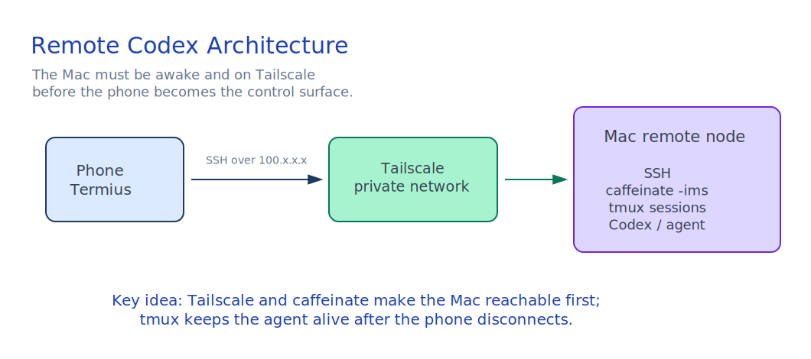
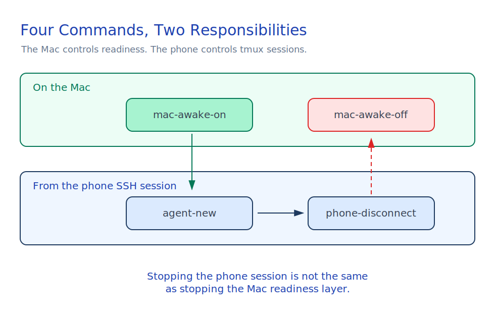
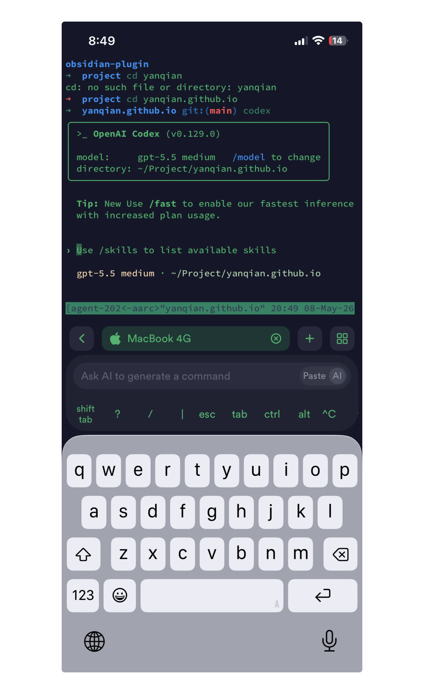

This is Part 1 of the Remote Agent Workflow series.

This guide explains how to control a Mac terminal from a phone and keep long-running agent tasks alive, such as Codex, automation scripts, or local development agents.

The goal is not remote desktop access. The goal is a reliable remote terminal workflow:

```text
Phone -> SSH -> Mac -> tmux -> Codex / agent task
```

With this setup, your Mac becomes a lightweight remote execution node that you can access from anywhere.

## What Each Tool Does

### SSH

SSH is the secure remote login protocol. It lets your phone open a terminal session on your Mac.

In this workflow, SSH provides:

- Secure command-line access to the Mac.
- Password or SSH key authentication.
- The ability to run commands remotely from a phone.

SSH does not keep tasks alive after the network connection drops. That is why tmux is needed.

### Tailscale

Tailscale creates a private network between your devices. It gives your Mac and phone stable private IP addresses, even when they are on different networks.

In this workflow, Tailscale provides:

- Remote access over 4G, 5G, hotel Wi-Fi, office Wi-Fi, or home Wi-Fi.
- A stable `100.x.x.x` address for the Mac.
- Encrypted device-to-device networking.
- No need to expose SSH directly to the public internet.

This guide assumes you use the official Tailscale macOS client. In that setup, the app manages the background service, login state, and menu bar status for you.

In daily use, the Tailscale client should stay running in the background. The command line is mainly for checking state:

```bash
tailscale status
tailscale ip
```

If the Mac is not connected, open the Tailscale app from the menu bar and connect it there. For this workflow, treat the macOS client as the primary control surface for Tailscale.

### Termius

Termius is the phone SSH client. It stores your SSH hosts, keys, and connection settings.

In this workflow, Termius provides:

- A mobile terminal interface.
- Saved SSH host configuration.
- SSH key management.
- Fast reconnection when your phone network changes.

You can use another SSH app, but Termius is convenient on mobile.

### tmux

tmux is a terminal session manager. It lets you start a shell session, detach from it, and reconnect later.

In this workflow, tmux provides:

- Long-running terminal sessions that survive phone disconnects.
- Easy re-entry into an existing Codex or agent session.
- Multiple remote terminal windows on the Mac.

Without tmux, closing Termius or losing network may terminate your active shell task.

### caffeinate

`caffeinate` is a built-in macOS command that prevents sleep while it is running.

In this workflow, caffeinate provides:

- Protection against idle sleep.
- More reliable long-running jobs.
- A simple way to keep Codex or an agent running while the screen is locked or off.

Important behavior:

| Mac action | Effect on remote task |
|---|---|
| Lock screen | Usually safe |
| Display turns off | Usually safe |
| Idle sleep | Unsafe unless caffeinate is running |
| Closing the laptop lid | Usually unsafe unless the Mac is configured for clamshell mode with power attached |

## Recommended Architecture

There are two layers in the practical setup:



```text
Host readiness layer:
  Tailscale client running
  caffeinate running
  Mac reachable and awake

Phone work layer:
  SSH from Termius
  create or attach tmux agent sessions
  detach when done
```

The important distinction is:

- The Mac must already be reachable and awake before the phone can SSH into it.
- The phone-side workflow should not be responsible for keeping the Mac alive.
- tmux keeps the agent session alive after the phone disconnects.

The recommended commands are:

```text
mac-awake-on     -> run on the Mac before remote work; checks Tailscale and starts caffeinate
agent-new        -> run from the phone SSH session; creates a new tmux agent session
phone-disconnect -> run from inside tmux; detaches the phone without stopping the agent
mac-awake-off    -> run when remote work is finished; stops caffeinate and allows sleep again
```

## Step 1: Enable SSH on the Mac

### Option A: Use System Settings

Open:

```text
System Settings -> General -> Sharing -> Remote Login
```

Turn on `Remote Login`.

### Option B: Use the Command Line

```bash
sudo systemsetup -setremotelogin on
```

Verify:

```bash
sudo systemsetup -getremotelogin
```

Expected output:

```text
Remote Login: On
```

If macOS blocks the command, give your terminal app the required permission in:

```text
System Settings -> Privacy & Security -> Full Disk Access
```

## Step 2: Install and Log In to the Tailscale Client

Install Tailscale on both:

- Your Mac.
- Your phone.

On the Mac, use the official Tailscale macOS client:

1. Install Tailscale.
2. Open the Tailscale app.
3. Log in to the same Tailscale account you use on your phone.
4. Keep the app running in the menu bar.
5. Enable launch at login if you want the Mac to be reachable after a restart.

On the Mac, check status:

```bash
tailscale status
```

If the Mac is not connected, use the Tailscale menu bar app to connect it.

Get the Mac Tailscale IP:

```bash
tailscale ip
```

You should see something like:

```text
100.x.x.x
```

This is the address your phone will use for SSH.

## Step 3: Configure Termius on the Phone

Create a new host in Termius:

```text
Address: 100.x.x.x
Username: your macOS username
Port: 22
```

You can get your macOS username with:

```bash
whoami
```

At this point, password login may already work. For regular use, SSH key login is better.

## Step 4: Configure SSH Key Login

Generate a dedicated SSH key for Termius on the Mac:

```bash
ssh-keygen -t ed25519 -f ~/.ssh/id_ed25519_termius
```

Add the public key to the Mac's authorized keys:

```bash
cat ~/.ssh/id_ed25519_termius.pub >> ~/.ssh/authorized_keys
chmod 700 ~/.ssh
chmod 600 ~/.ssh/authorized_keys
```

Print the private key:

```bash
cat ~/.ssh/id_ed25519_termius
```

Import the private key into:

```text
Termius -> Keychain -> Import Key
```

Then edit the Termius host and select this key for authentication.

Test the connection. A successful login should show a shell prompt like:

```text
yourname@MacBook ~ %
```

## Step 5: Install tmux

If tmux is not installed:

```bash
brew install tmux
```

Create a session manually:

```bash
tmux new -s agent
```

Detach without stopping the task:

```text
Ctrl + B, then D
```

Reattach later:

```bash
tmux attach -t agent
```

## Step 6: Add Remote Workflow Scripts



All scripts live on the Mac. The difference is when you use them:

- Run `mac-awake-on` directly on the Mac before you leave it as a remote machine.
- Run `agent-new` after connecting from the phone through SSH.
- Run `phone-disconnect` from inside tmux when you want to leave the phone session.
- Run `mac-awake-off` when you no longer need the Mac to stay awake.

Create a personal scripts directory:

```bash
mkdir -p ~/.local/bin
```

Create `~/.local/bin/mac-awake-on`:

```bash
#!/bin/zsh

set -e

PID_FILE="/tmp/remote-caffeinate.pid"

echo "Preparing this Mac for remote access..."

if pgrep -x "Tailscale" >/dev/null 2>&1; then
  echo "Tailscale macOS client is running."
else
  echo "Opening Tailscale macOS client..."
  open -a Tailscale || true
  sleep 2
fi

if command -v tailscale >/dev/null 2>&1; then
  TAILSCALE_READY="false"

  for _ in 1 2 3 4 5; do
    if tailscale status >/dev/null 2>&1; then
      TAILSCALE_READY="true"
      break
    fi
    sleep 2
  done

  if [ "$TAILSCALE_READY" = "true" ]; then
    echo "Tailscale is online."
    echo "Tailscale IP:"
    tailscale ip
  else
    echo "Tailscale is not connected."
    echo "Open the Tailscale macOS app from the menu bar and connect this Mac."
    exit 1
  fi
else
  echo "Warning: tailscale command not found."
  echo "Install the official Tailscale macOS client and keep it running."
  exit 1
fi

if [ -f "$PID_FILE" ] && kill -0 "$(cat "$PID_FILE")" 2>/dev/null; then
  echo "caffeinate is already running."
else
  echo "Starting caffeinate..."
  caffeinate -ims &
  echo $! > "$PID_FILE"
fi

echo "Mac remote readiness is on."
echo "You can now SSH into this Mac from your phone."
```

Create `~/.local/bin/agent-new`:

```bash
#!/bin/zsh

set -e

if ! command -v tmux >/dev/null 2>&1; then
  echo "tmux is not installed. Install it with: brew install tmux"
  exit 1
fi

SESSION_NAME="${1:-agent-$(date +%Y%m%d-%H%M%S)}"

if tmux has-session -t "$SESSION_NAME" 2>/dev/null; then
  echo "Session already exists: $SESSION_NAME"
  echo "Attaching..."
  tmux attach -t "$SESSION_NAME"
  exit 0
fi

echo "Creating tmux session: $SESSION_NAME"
tmux new-session -s "$SESSION_NAME"
```

Create `~/.local/bin/phone-disconnect`:

```bash
#!/bin/zsh

set -e

if [ -n "$TMUX" ]; then
  tmux detach-client
else
  echo "You are not inside a tmux session."
  echo "Use 'exit' to close the SSH shell."
fi
```

Create `~/.local/bin/mac-awake-off`:

```bash
#!/bin/zsh

set -e

PID_FILE="/tmp/remote-caffeinate.pid"

echo "Turning off Mac remote readiness..."

if [ -f "$PID_FILE" ]; then
  PID="$(cat "$PID_FILE")"

  if kill -0 "$PID" 2>/dev/null; then
    kill "$PID"
    echo "caffeinate stopped."
  else
    echo "No active caffeinate process found."
  fi

  rm -f "$PID_FILE"
else
  echo "No remote caffeinate PID file found."
fi

echo "Mac can sleep normally again."
echo "Tailscale is left running so the Mac remains reachable when awake."
```

Make the scripts executable:

```bash
chmod +x ~/.local/bin/mac-awake-on ~/.local/bin/agent-new ~/.local/bin/phone-disconnect ~/.local/bin/mac-awake-off
```

Make sure `~/.local/bin` is in your shell path. Add this to `~/.zshrc` if needed:

```bash
export PATH="$HOME/.local/bin:$PATH"
```

Reload your shell:

```bash
source ~/.zshrc
```

## Step 7: Daily Workflow

### Before Leaving the Mac

On the Mac, start the host readiness layer:

```bash
mac-awake-on
```

This makes sure:

- The Tailscale client is running.
- The Mac is visible on your Tailscale network.
- `caffeinate` is running so the Mac does not idle sleep.

### From the Phone

Open Termius and connect to the Mac through its Tailscale IP.

Create a new tmux agent session:

```bash
agent-new
```

You can also give the session a specific name:

```bash
agent-new codex
```

Inside tmux, run Codex or your agent task:

```bash
codex
```

Or:

```bash
node orchestrator.js
```

Detach from tmux without stopping the task:

```bash
phone-disconnect
```

You can also use the native tmux shortcut:

```text
Ctrl + B, then D
```

After detaching from tmux, close the SSH shell:

```bash
exit
```

### Reconnect Later

SSH from Termius again, then attach to an existing tmux session:

```bash
tmux ls
tmux attach -t codex
```

Or create a fresh session:

```bash
agent-new
```

### When Remote Work Is Finished

When you are done and want to allow the Mac to sleep normally again, run:

```bash
mac-awake-off
```

This stops `caffeinate`. It does not quit Tailscale, because keeping Tailscale running makes the Mac reachable again the next time it is awake.

## Recommended Defaults

Use these defaults unless you have a specific reason not to:

| Component | Recommended setting |
|---|---|
| Tailscale | Keep running in the background |
| SSH | Enable Remote Login |
| SSH authentication | Use a dedicated SSH key |
| tmux session | Keep an `agent` session |
| caffeinate | Start with `mac-awake-on`, stop with `mac-awake-off` |

## Security Notes

Use a dedicated SSH key for Termius instead of reusing your main personal key.

Keep SSH access limited to trusted networks. Tailscale is preferable to exposing port `22` directly to the public internet.

If you no longer use a phone or key, remove its public key from:

```bash
~/.ssh/authorized_keys
```

You can check currently logged-in users with:

```bash
who
```

You can check SSH-related logs with:

```bash
log show --predicate 'process == "sshd"' --last 1h
```

## Troubleshooting

### Termius Cannot Connect

Check that Remote Login is enabled:

```bash
sudo systemsetup -getremotelogin
```

Check the Mac's Tailscale status:

```bash
tailscale status
```

Check the IP:

```bash
tailscale ip
```

Make sure Termius uses:

```text
Host: 100.x.x.x
Port: 22
Username: your macOS username
```

### SSH Works on Wi-Fi but Not on 4G or 5G

Use the Tailscale IP, not the local `192.168.x.x` IP.

The local IP only works on the same LAN. The Tailscale IP works across networks.

### Task Stops After Disconnecting

Run the task inside tmux. From the phone SSH session:

```bash
agent-new codex
```

Detach with:

```bash
phone-disconnect
```

Or use the tmux shortcut:

```text
Ctrl + B, then D
```

Do not close the shell before detaching.

### Task Stops After the Mac Sleeps

Before relying on phone access, run this on the Mac:

```bash
mac-awake-on
```

This starts `caffeinate -ims` in the background and checks that Tailscale is available.

### The Laptop Stops After Closing the Lid

For MacBooks, closing the lid can still interrupt work unless the machine is connected to power and configured for clamshell mode with an external display or appropriate power settings.

For reliable agent runs, keep the Mac connected to power and avoid closing the lid unless you have verified your setup.

## Final Mental Model

Remote Mac access is three separate problems:

```text
Network access: Tailscale
Remote login: SSH + Termius
Long-running execution: tmux + caffeinate
```

Once these are separated, the workflow becomes simple:

```bash
# On the Mac
mac-awake-on

# From the phone after SSH
agent-new codex

# From inside tmux when leaving the phone session
phone-disconnect

# When remote work is fully finished
mac-awake-off
```

This gives you a lightweight remote execution system controlled from your phone.

## Connected From the Phone

After the setup is complete, a successful mobile session should look like this:



In this example, the phone is connected to the Mac through Termius, the shell is inside a tmux session, and Codex is running inside the remote project directory.

## Remote Agent Workflow Series

Series index: [Remote Agent Workflow](/posts/publish/remote-agent-workflow/)

1. [Remote Agent Workflow, Part 1: Remote Mac Terminal for Codex](/posts/publish/remote-mac-terminal-for-codex/)
2. [Remote Agent Workflow, Part 2: From Remote Shell to Agent Control Plane](/posts/publish/from-remote-shell-to-agent-control-plane/)
3. [Remote Agent Workflow, Part 3: Turning Telegram into a Local Codex Control Plane](/posts/publish/turning-telegram-into-a-local-codex-control-plane/)
4. [Remote Agent Workflow, Part 4: In the Repository, Not in the Chat](/posts/publish/in-the-repository-not-in-the-chat/)
5. [Remote Agent Workflow, Part 5: What Still Matters After Codex Mobile](/posts/publish/what-still-matters-after-codex-mobile/)
