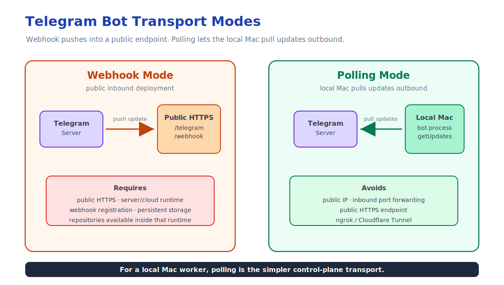
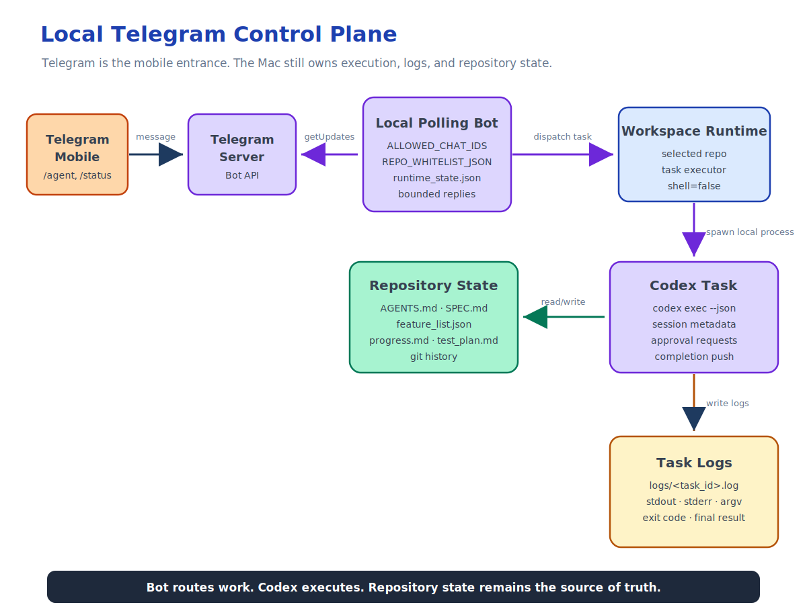

This is Part 3 of the Remote Agent Workflow series.

In the previous articles, I started with a practical remote terminal setup:

```text
Phone -> Tailscale -> SSH -> Mac -> tmux -> Codex
```

That gave me a reliable way to reach my Mac from a phone.

Then I hit the next limitation: a phone is not a good terminal.

Mobile SSH is useful for emergencies, but it is not the interface I want for long-running AI development. I do not want to type shell commands, attach tmux sessions, scroll logs, and manually reconstruct state from a narrow phone screen.

What I want is closer to this:

```text
Phone -> task interface -> local agent runtime -> repository state
```

That led me to build a small Telegram Bot as a local control plane for Codex.

The point is not that Telegram is special.

The point is that the phone becomes a control surface, while the Mac remains the worker.

## Why Telegram

Telegram is a convenient mobile client for this experiment because it already gives me:

- mobile notifications
- short command messages
- reply threads
- inline buttons
- cross-device history
- a mature Bot API

More importantly, Telegram supports two different deployment models.



The first model is webhook mode:

```text
Telegram Server -> public HTTPS endpoint -> Bot runtime
```

That is the normal production-style setup.

It requires:

- a public HTTPS endpoint
- a server or cloud runtime
- webhook registration
- persistent runtime storage
- access to the target repositories from that runtime

That can work well if the bot is deployed on a VPS, VM, Cloud Run service, or other public runtime.

But it is not the simplest shape for my use case.

I want the bot to control my local Mac, where my repositories, credentials, development tools, and Codex runtime already exist.

So the second model is more interesting: polling.

```text
Local Mac Bot -> Telegram Server
```

With polling, the local bot process actively asks Telegram for new updates.

That means I do not need:

- public IP
- inbound port forwarding
- HTTPS endpoint
- ngrok
- Cloudflare Tunnel

The Mac does not need to accept public inbound traffic.

It only needs outbound network access to Telegram.

That fits the same design philosophy as the Tailscale SSH setup:

```text
Keep execution local.
Avoid exposing the Mac directly.
Make the control surface reachable from the phone.
```

## The Minimal Shape

At the simplest level, a local polling bot looks like this:



```text
Telegram Mobile
  -> Telegram Server
  -> local polling process on Mac
  -> selected workspace
  -> Codex process
  -> logs and repo files
```

In Node.js, the polling idea is conceptually simple:

```js
const bot = new TelegramBot(token, { polling: true });
```

My implementation does not depend on that exact library shape, but the operational model is the same: the local process keeps polling Telegram, dispatches valid messages into the application handler, and sends responses back through the Telegram API.

The important part is not the transport.

The important part is what happens after a message arrives.

## The Bot Is a Control Plane

The bot should not be the coding agent.

It should not implement product logic.

It should not decide which feature is done.

It should not rewrite repository planning files directly.

It should not treat Telegram chat history as project memory.

The bot is only a control plane.

Its responsibilities are narrower:

- authenticate the Telegram chat
- select one whitelisted repository
- validate the selected workspace
- start a local Codex task
- persist task metadata
- write full logs to disk
- return bounded responses to Telegram
- track Codex session IDs when available
- allow task status inspection
- allow task termination
- forward approval requests when possible

That boundary matters.

If the bot starts owning the development lifecycle, it becomes another agent framework.

I do not want that.

I want the bot to provide a mobile entry point into the workflow I already use locally.

## Repository Whitelist Instead of Free-Form Paths

The bot should not accept arbitrary paths from Telegram.

This would be too dangerous:

```text
/cd /some/random/path
```

or:

```text
/run rm -rf ...
```

The control plane should expose a constrained surface.

In my implementation, repositories are configured through a whitelist:

```json
{
  "agent-remote-tg": "/Users/armstrong/Project/agent-remote-tg"
}
```

The phone can list configured repositories:

```text
/repos
```

Then select one by alias:

```text
/use agent-remote-tg
```

After that, workspace inspection commands operate only inside the selected repository:

```text
/pwd
/ls
/git
```

This is intentionally less flexible than a shell.

That is the point.

A mobile control plane should make the safe path easy and the unsafe path unavailable.

## Starting Agent Work

The main command is:

```text
/agent <instruction>
```

For example:

```text
/agent Review the current repository state and summarize what is ready to implement next.
```

Or:

```text
/agent Implement the next small feature according to AGENTS.md. Run the verification script before summarizing.
```

The bot starts a local Codex process in the selected workspace.

The important details:

- the process is started without shell execution
- stdout and stderr are written to a local log file
- task metadata is stored in runtime state
- Telegram receives a task ID immediately
- the full output is not dumped into the chat

That gives the phone a much better interface than SSH.

Instead of staring at a live terminal, I can ask:

```text
/status
```

or:

```text
/logs task-0001
```

The local machine keeps the full detail. Telegram only receives bounded summaries.

## New Sessions, Resume, and Chat Mode

One tricky part of remote agent control is session continuity.

Sometimes I want a fresh Codex thread.

Sometimes I want to resume an existing one.

Sometimes I just want to keep sending follow-up messages from Telegram without repeating the command prefix.

The bot supports those shapes:

```text
/agent new <instruction>
/agent resume <session_id> <instruction>
/agent resume --last <instruction>
/agent session
/agent exit
```

After a session is bound to the current Telegram chat and selected repository, normal text messages can continue the agent session.

That changes the mobile experience.

Instead of typing:

```text
/agent resume <long-session-id> Continue from the last result...
```

I can send a short follow-up after the session is established:

```text
Continue with the smallest remaining fix and run the relevant tests.
```

The bot still keeps slash commands as commands.

So I can inspect or control the runtime at any point:

```text
/agent session
/status
/logs task-0003
/stop task-0003
```

This is not trying to recreate an interactive terminal.

It is a task interface for a local agent runtime.

## Runtime State Is Not Project State

The bot stores runtime state.

That includes things like:

- selected repository
- current workspace path
- task records
- task status
- task log paths
- Codex session bindings
- approval requests
- Telegram polling offset

This state is useful for operating the control plane.

But it is not the source of truth for the project.

The project state still belongs in the repository:

- `AGENTS.md`
- `SPEC.md`
- `feature_list.json`
- `progress.md`
- `test_plan.md`
- `init.sh`
- `orchestrator.py`
- git history

This separation is the core design decision.

The bot can remember that `task-0003` was started and where its log lives.

But the bot should not decide that feature `F043` is complete.

That belongs to the repository workflow, the verification script, the evaluator, and git history.

## Logs Are Local, Responses Are Bounded

A terminal encourages raw output.

A mobile chat interface should not.

Long logs are hard to read on a phone, and dumping them into Telegram creates a noisy, fragile workflow.

So the bot writes full task output to local files:

```text
logs/<task_id>.log
```

Telegram responses stay bounded.

For a running task, the phone should show enough information to know what is happening.

For a finished task, it should show a concise final result.

If I need the raw log, it still exists locally on the Mac.

This is another reason the control plane is not a terminal replacement.

It is a remote operating surface for local work.

## Approval Forwarding

Long-running Codex tasks may request approval for an action.

If I am away from the Mac, I still need a way to see that request and respond.

The control plane can detect approval requests in Codex output and forward them to Telegram as structured choices.

Conceptually:

```text
Codex approval request
  -> bot captures request
  -> Telegram message with options
  -> user approves or rejects
  -> bot records the decision
```

This is exactly the kind of interaction a phone is good at.

I do not want to edit a shell command on the phone.

But I can quickly review a bounded approval prompt and tap a decision.

There is an important caveat: approval delivery depends on the runtime protocol. Detecting and surfacing a request is easier than reliably writing the selected decision back into a non-interactive child process.

That limitation is acceptable for an MVP as long as the bot is honest about it.

The useful part is the shape of the control surface:

```text
The phone handles decisions.
The Mac handles execution.
The repository handles durable state.
```

## What This Replaces

This does not replace SSH completely.

I still want SSH as a lower-level escape hatch.

If something breaks badly, I may need to connect with Termius, attach tmux, inspect files, or restart the bot.

But SSH should be the fallback path, not the daily interface.

The daily interface should be:

```text
/use repo
/agent instruction
/status
/logs task
/stop task
```

That is much closer to how I actually want to work from a phone.

## What This Does Not Try to Solve

This control plane is intentionally small.

It does not provide:

- arbitrary shell access
- remote desktop
- free-form filesystem browsing
- cloud deployment automation
- a full web dashboard
- a replacement for Codex
- a replacement for the repository workflow

Those exclusions keep the system understandable.

The bot is allowed to be boring.

It only needs to make the common remote agent workflow easier:

```text
select repo
start task
check status
read result
continue session
stop task
approve or reject when needed
```

## The Bigger Pattern

The Telegram Bot is only one implementation.

The same pattern could be implemented with Slack, a small web UI, a native mobile app, or even a private command server.

The important architecture is:

```text
Mobile Client
  -> Control Plane
  -> Workspace Runtime
  -> Codex / orchestrator
  -> Repo State + Logs
```

Once I started thinking in this shape, the role of each layer became clearer:

- The mobile client is for intent and decisions.
- The control plane is for authorization, task routing, and status.
- The workspace runtime is for local execution.
- Codex or the orchestrator is for agent work.
- The repository is for durable state and verification.

That is the shift from remote terminal to remote agent workflow.

The first article made the Mac reachable.

The second article explained why SSH is not enough.

This layer turns the phone into a real control plane for local Codex work.

The next problem is even more important:

```text
If the agent can run remotely and asynchronously, where should long-term project memory live?
```

My answer is: in the repository, not in the chat.

## Remote Agent Workflow Series

Series index: [Remote Agent Workflow](/posts/publish/remote-agent-workflow/)

1. [Remote Agent Workflow, Part 1: Remote Mac Terminal for Codex](/posts/publish/remote-mac-terminal-for-codex/)
2. [Remote Agent Workflow, Part 2: From Remote Shell to Agent Control Plane](/posts/publish/from-remote-shell-to-agent-control-plane/)
3. [Remote Agent Workflow, Part 3: Turning Telegram into a Local Codex Control Plane](/posts/publish/turning-telegram-into-a-local-codex-control-plane/)
4. [Remote Agent Workflow, Part 4: In the Repository, Not in the Chat](/posts/publish/in-the-repository-not-in-the-chat/)
5. [Remote Agent Workflow, Part 5: What Still Matters After Codex Mobile](/posts/publish/what-still-matters-after-codex-mobile/)
