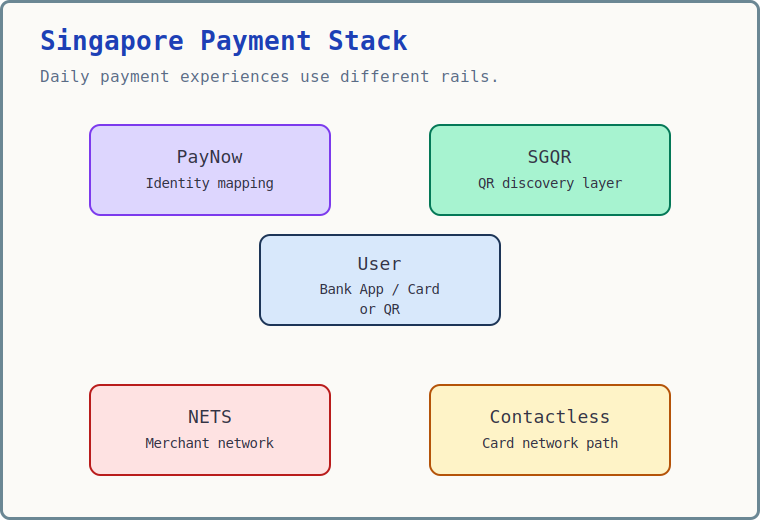

If you live in Singapore, you probably use these payment methods every day:

- You send money to a friend via PayNow.
- You scan a QR code at a hawker stall.
- You tap your card or phone at a supermarket.
- You use NETS at a local merchant.

They look similar from the user side, but underneath they solve different problems.

---

## The Big Picture



The diagram is intentionally simplified. It follows the order most users experience payments: first the app, card, or QR code; then familiar payment entry points such as SGQR and PayNow; then the merchant networks, card networks, and money movement rails underneath.

---

## User Layer: Bank Apps, Cards, and QR

Most people do not start by thinking about payment rails.

They start from a user interface:

- A banking app such as DBS, OCBC, or UOB.
- A wallet-like app such as DBS PayLah!.
- A QR scanner inside a payment app.
- A physical card.
- A phone wallet such as Apple Pay or Google Pay.

This top layer is what makes payments feel simple.

For example, when you scan a hawker stall's QR code using a bank app or PayLah!, you are not manually choosing between registries, schemes, and settlement systems. The app reads the QR code, identifies supported payment options, asks you to confirm the payment, and then sends the transaction into the right underlying path.

That is the key mental model:

```text
User experience layer
  -> payment scheme or proxy layer
  -> money movement or settlement layer
```

The rest of the article explains what those lower layers are.

---

## SGQR: The Unified QR Layer

SGQR stands for **Singapore Quick Response Code**.

It is not a payment rail by itself.

It is a QR standard.

Before SGQR, merchants often needed many QR codes:

```text
PayNow QR | NETS QR | GrabPay QR | Others
```

SGQR combines them into one standard QR label and payload format.

The QR can contain:

- Merchant name
- Supported payment schemes
- PayNow proxy
- NETS merchant ID
- Optional amount
- Transaction reference

The subtle but important point is that SGQR does not decide how money settles. It is closer to a container or discovery layer. After the user scans the SGQR code, the selected app and selected payment scheme determine the actual payment path.

---

## PayNow: The Identity Layer

PayNow is one of the most familiar payment experiences in Singapore.

It solves a usability problem:

> How do I send money without knowing someone's bank account number?

Instead of entering bank details, you can use:

- Mobile number
- NRIC / FIN
- UEN for businesses
- Virtual Payment Address, or VPA, for some non-bank financial institution wallets

```text
Mobile / NRIC / FIN / UEN / VPA
  -> PayNow Registry
  -> Bank account or participating e-wallet account
  -> FAST
```

The important idea is that PayNow is not the money-moving rail itself. It is a proxy addressing system that helps the sender find the correct receiving account or participating wallet.

PayNow is commonly used for person-to-person transfers, but it is not limited to friends and family. Businesses, government agencies, associations, and societies can receive money through PayNow Corporate by linking a UEN.

There is also a security angle. From 6 June 2026, the PayNow nickname feature for retail customers is scheduled to be discontinued in Singapore. Instead of a user-chosen nickname, payers will see selected letters of the payee's registered account name. The goal is to reduce impersonation scams while still preserving some privacy.

---

## FAST: The Money Highway

FAST stands for **Fast And Secure Transfers**.

It is the real-time interbank transfer network in Singapore.

It answers one core question:

> How does money move from one bank account to another almost instantly?

Example:

```text
DBS Account -> OCBC Account
```

FAST is the underlying rail used by PayNow for domestic Singapore dollar transfers.

From a user perspective, FAST is usually invisible. You see PayNow in your app. The system uses FAST underneath to move Singapore dollars between participating institutions.

---

## Contactless Cards: payWave, PayPass, and Mobile Wallets

payWave is Visa's contactless card payment technology.

In daily language, people often use "payWave" to mean tapping a card or phone, although technically Mastercard, American Express, and mobile wallets have their own contactless implementations.

For a system design mental model, it is better to think of this as the **contactless card path**:

```text
Contactless card or phone
  -> POS terminal
  -> Acquirer
  -> Card network
  -> Issuer authorization
  -> Merchant settlement later
```

When you tap a phone with Apple Pay or Google Pay, the user experience looks similar to tapping a card. Underneath, it is usually still a tokenized card transaction, not a PayNow transfer.

payWave is different from PayNow.

```text
PayNow / FAST = real-time account-to-account transfer
Contactless   = card authorization first, settlement later
```

---

## NETS: The Local Merchant Network

NETS is something many people still encounter at supermarkets, local merchants, debit card terminals, NETS QR, and NETS Contactless. But compared with scanning QR codes or tapping cards, it is often less visible as a separate system.

It is different from PayNow.

PayNow is mostly about account-to-account payments using a proxy. NETS is more about local merchant acceptance.

It supports:

- NETS card payments
- POS terminals
- NETS QR
- NETS Contactless
- Merchant acquiring

NETS is both a domestic payment brand and an acceptance network, with different products for POS, QR, online, stored-value, and motoring payments.

A useful mental model:

```text
PayNow = account-to-account payment using a proxy
NETS   = local merchant acceptance and payment network
```

---

## Who Does What

| Layer | What it does |
|---|---|
| Bank apps / wallets / cards | User interface, authentication, confirmation, and transaction initiation |
| SGQR | QR presentation and payload standard |
| PayNow | Proxy addressing and recipient lookup |
| FAST | Real-time interbank Singapore dollar transfer rail |
| Visa / Mastercard / Amex | Global card authorization and settlement networks |
| NETS | Domestic merchant acceptance and payment network |
| Banks / NFIs | Customer accounts, apps, risk checks, limits, and user experience |

This separation matters because a payment product often combines multiple layers. For example, a bank app may scan an SGQR code, use PayNow to resolve the merchant, and rely on FAST to move money.

---

## A Quick Comparison

| Payment Method | Main Use Case | Underlying Model | Settlement |
|---|---|---|---|
| Bank apps / wallets / cards | User-facing payment entry | App UI, authentication, limits, and confirmation | Depends on selected payment path |
| SGQR | QR entry point | Standardized QR format | Depends on selected payment scheme |
| PayNow | P2P, hawkers, small merchants, businesses | Account-to-account payment using proxy addressing | Real-time / near real-time |
| FAST | Bank-to-bank transfer | Real-time payment rail | Real-time |
| Contactless cards | Retail, malls, transport-linked cards, mobile wallets | Card network authorization | Later settlement |
| NETS | Local merchant payments | Local debit and merchant acceptance network | Merchant settlement |

One caveat: user confirmation, merchant notification, settlement, and reconciliation are related but not always the same thing. A consumer may see a payment succeed immediately while the merchant still relies on later reporting, batching, or reconciliation.

---

## A Real-Life Example

At a hawker stall:

```text
Scan SGQR with a bank app or PayLah!
  -> app reads the SGQR payload
  -> selected scheme may be PayNow, NETS QR, GrabPay, etc.
  -> payment follows that scheme's rail
```

If the selected scheme is PayNow:

```text
PayNow resolves the merchant proxy
  -> FAST moves money
  -> merchant receives payment notification
```

At a supermarket:

```text
Tap card or phone
  -> POS terminal
  -> Visa / Mastercard / Amex or NETS network
  -> issuer approves transaction
  -> merchant settles later
```

---

## Beyond Singapore

The same layered idea also appears in cross-border payments.

PayNow has been linked with overseas faster payment systems such as Thailand's PromptPay, India's UPI, and Malaysia's DuitNow.

The user experience still feels simple: send money using a familiar identifier. But the cross-border path adds more moving parts:

- Foreign exchange
- Participating banks or non-bank financial institutions
- Cross-border gateway arrangements
- Scheme-specific limits and compliance checks

So the domestic mental model still helps, but cross-border payments are not just "FAST, but international."

---

## Final Mental Model

Singapore's payment system is interesting because it separates concerns clearly:

- Bank apps, wallets, cards, and QR scanners provide the user experience.
- SGQR standardizes QR entry.
- PayNow resolves identity.
- FAST moves money between accounts.
- Contactless card payments use card network authorization and later settlement.
- NETS handles local merchant acceptance.

That is why paying feels simple in daily life, even though the underlying system is layered and complex.

---

## Further Reading

- [FAST - Association of Banks in Singapore](https://www.abs.org.sg/e-payments/fast)
- [PayNow - Association of Banks in Singapore](https://www.abs.org.sg/e-payments/pay-now)
- [SGQR fact sheet - IMDA](https://www.imda.gov.sg/-/media/imda/files/about/media-releases/2018/annex-a--singapore-quick-response-code-sgqr.pdf)
- [Visa contactless payments in Singapore](https://www.visa.com.sg/pay-with-visa/contactless-payments/contactless-payments.html)
