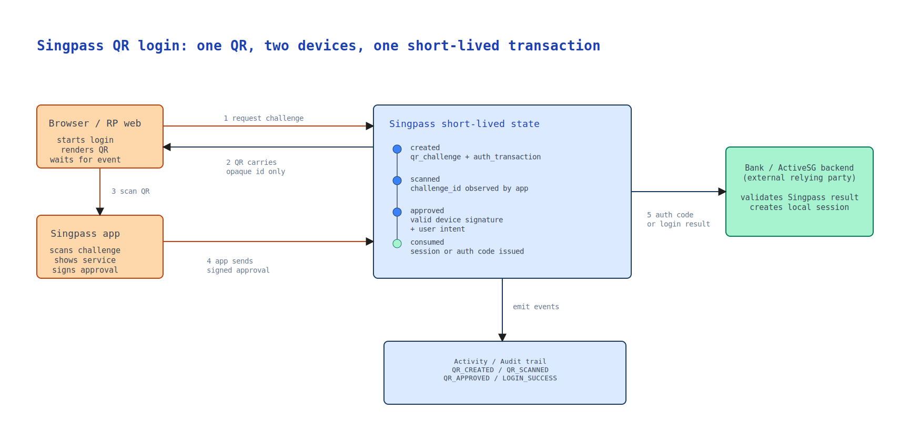

You open a banking website on your laptop.

You click "Log in with Singpass".

A QR code appears.

You open the Singpass app, scan the code, check the service name, approve the login, and the website suddenly knows it can let you in.

From the user's point of view, the whole thing feels almost too simple. The QR code appears, the phone approves, the browser continues.

But the important question is:

```text
What exactly did the QR code prove?
```

The answer is not "the QR code contains my identity".

A good QR login design should do almost the opposite. The QR code should not contain your NRIC, your name, your profile, or a long-lived login token. It should be a short-lived invitation to complete an authentication transaction.

In system design terms:

```text
QR login is not identity inside a QR code.
It is a short-lived challenge, 
approved by a trusted mobile credential,
then consumed by the web login session.
```

That distinction is the heart of the design.



This is the familiar surface: scan or tap a QR code to log in. The important part is what the QR code is allowed to represent, how quickly it expires, and which browser session the approval will bind to.



## The QR Code Is Only The Doorway

The first mistake is to treat the QR code as the secret.

It is tempting to imagine that the QR code carries some magic identity data. After all, the user scans it and the browser logs in. But if the QR code itself were enough to log in, anyone who saw it could copy it, send it, or reuse it.

That would be a dangerous design.

A better design is to make the QR code contain only an opaque challenge:

```text
qr_challenge_id = "random-looking short-lived identifier"
```

This identifier does not mean much by itself. It points to server-side state created when the browser started the login request.

The server knows:

- which relying party requested the login
- which browser session is waiting
- what scope or action is being requested
- when the challenge expires
- whether the challenge has already been scanned, approved, rejected, expired, or consumed

The QR code is simply a way for the mobile app to say:

```text
I am responding to this specific login attempt.
```

That is why QR login needs a short-lived backend state machine, not just QR generation.

The flow looks simple on screen, but underneath it behaves more like this:

```text
created -> scanned -> approved -> consumed
       \-> expired
       \-> rejected
       \-> cancelled
```

This state machine matters because login is not a static page. It is an interactive transaction across two devices, and unsafe transitions should be rejected:

```text
expired -> approved
consumed -> approved
approved -> approved again
```

If two approval requests arrive because of retry, network delay, or duplicate taps, the system should not create two browser sessions or issue two authorization codes. Only the first valid approval should win.

This is also why the challenge should expire quickly. The danger is not that the QR code contains your identity. A well-designed QR code should not contain that. The danger is that the QR code points to a real login transaction that is still waiting for approval.

For example, an attacker could start a login on their own browser, copy the QR code, and show it to a victim in a different conversation or webpage. If the victim scans and approves without checking the service name and context, the victim may be approving the attacker's browser session rather than a session they intended to start.

Short expiry reduces the time available for relay or context confusion. A good challenge should be short-lived, one-time use, bound to the original login transaction, and invalid after approval, rejection, expiry, or consumption.

The browser is waiting.

The phone is approving.

The server is deciding whether these two things belong to the same authentication attempt.

## Why The Phone Matters

The second mistake is to think the phone is merely forwarding the QR code.

The mobile app has a stronger role. It is the place where the user has already set up a trusted Singpass app credential.

Public Singpass material describes Singpass Login as a way for residents to log in to digital services using the Singpass app without passwords. The important design idea is that the app is not only a nicer UI. It is an authenticator.

When the app scans the QR code, a secure design should not send full user identity records to the backend. It should send a small request such as:

```text
challenge_id
device_or_credential_id
timestamp
signature_over_the_challenge_context
```

The `device_or_credential_id` is a lookup hint. The backend still needs to read the stored credential metadata and verify that this device is valid, active, and belongs to the right account.

The signature is the important proof.

The mobile device can sign the challenge context using a key associated with the app credential. The server can verify that signature using the stored public key. This means the server is not trusting the QR code alone. It is trusting that a valid registered authenticator approved this exact challenge.

In plain English:

```text
The phone is not telling the browser "I am Alice".
The phone is proving to Singpass
that a valid Singpass app credential approved this login request.
```

That is a much stronger mental model.

## The User Must See What They Are Approving

QR login should not be invisible.

Before approval, the app should show the user what is being requested. At minimum, the user should see the service name and enough context to recognise the request.

This small UX detail is actually part of the security model.

If the app only shows a generic "Approve login" button, the user may approve the wrong thing. If an attacker tricks a user into scanning a QR code from another website, the user needs a chance to notice that the service name or context is wrong.

So the approval screen is not just decoration. It is where human intent enters the protocol.

A good approval screen answers:

- Who is asking?
- What action is being approved?
- Is this a login or a higher-risk transaction?
- Does this match what I just did on my browser?

The system can verify keys and tokens, but only the user can verify intent.

That is why serious authentication systems need both cryptographic checks and clear human confirmation.

## How The Browser Finds Out

After the user approves on the phone, the browser still needs to continue.

There are several ways to do this. The browser may subscribe to a WebSocket or Server-Sent Events channel. It may poll the backend every few seconds. The implementation choice can vary, but the concept is the same:

1. Browser starts a login transaction.
2. Backend creates a QR challenge.
3. Browser waits for status changes.
4. Mobile app scans and approves.
5. Backend marks the challenge as approved.
6. Browser receives the success event.

For a first-party website, the backend may create a browser session.

For a relying party such as a bank, ActiveSG, or another approved service, the result is usually part of an OpenID Connect flow. Singpass acts as the OpenID Provider. The service is the relying party.

This boundary matters.

Singpass should authenticate the user and issue the appropriate result through the standard flow. The relying party should validate the result and then create its own local session.

The relying party should not simply trust a front-end message that says "login success". Its backend needs to validate what Singpass issued.

Public Singpass developer documentation describes Singpass as Singapore's national digital identity authentication provider using OpenID Connect, and says it supports the authorization code flow. In that model, the browser should not receive long-lived tokens directly. The relying party receives an authorization code through the redirect flow, and its backend exchanges that code for tokens.

That detail sounds technical, but the user-facing consequence is simple:

```text
The browser is not logged in because it saw a QR code.
It is logged in because the relying party completed
a trusted authentication flow with Singpass.
```

## What Can Go Wrong

QR login is convenient, but convenience always creates new edges.

One risk is phishing by context confusion. A user may think they are logging in to one service while the QR code belongs to another. Showing the service name and request context helps, but it depends on users paying attention.

Another risk is challenge relay. If a still-valid QR code is copied into a different context, the scan may no longer belong to the user's original mental model. This is why the challenge should expire quickly, require approval from a valid app credential, and show the relying party clearly before approval.

A third risk is session binding. The approval should be tied to the browser transaction that created the QR code. Otherwise, a login approved on the phone might accidentally complete the wrong browser session.

A fourth risk is replay. A captured approval message should not be reusable. Timestamps, signatures, nonce-like challenge data, and one-time consumption all help reduce this risk.

These are not exotic problems. They are the ordinary problems of cross-device authentication.

The user sees one scan.

The system sees a distributed state machine.

## Why This Is Better Than Password Login

Password login asks the user to type a shared secret into a website.

That creates familiar problems:

- passwords can be reused
- passwords can be phished
- passwords can be weak
- users may type them into fake sites
- services need recovery flows for forgotten passwords

QR login changes the shape of the interaction.

The user does not type a password into the relying party website. The user approves through the Singpass app, which is already bound to the user's device and credential.

This does not make attacks impossible. No authentication method does. But it removes one of the weakest habits in web security: asking users to repeatedly type secrets into many different websites.

It also creates a better pattern for step-up authentication.

For a low-risk login, app approval may be enough. For a higher-risk action, the system may require a stronger method such as biometric verification, face verification, or explicit transaction signing.

This is the larger design idea:

```text
Authentication should match the risk of the action.
```

QR login is one piece of that model.

## The Small Flow Hides A Big Architecture

When you scan a Singpass QR code, several trust relationships are being coordinated:

- The relying party trusts Singpass as the identity provider.
- Singpass trusts the registered mobile app credential after verifying it.
- The browser waits for the specific login transaction it created.
- The user checks the service name and approves the action.
- The relying party validates the authentication result before creating its own session.

This is why the feature feels simple but is not simplistic.

The QR code is the visible object, but the real system is made of:

- short-lived challenge state
- mobile app credentials
- signature verification
- browser-to-server event updates
- relying-party redirect flows
- token validation
- login activity records
- audit events

That is the pattern I find interesting in Singpass.

The user experience is one small gesture: scan and approve.

The infrastructure underneath is doing a much more serious job:

```text
It turns a moment of user intent on one device
into a trusted login result on another device.
```

That is why QR login is not merely a smoother login UI.

It is a compact example of national trust infrastructure becoming part of everyday life.

## References

- [Singpass Login](https://docs.developer.singpass.gov.sg/docs/products/singpass-login)
- [Overview of Singpass](https://docs.developer.singpass.gov.sg/docs/introduction/overview-of-singpass)
- [Understanding the basics of OIDC](https://docs.developer.singpass.gov.sg/docs/introduction/understanding-the-basics-of-oidc)
- [Singpass for Individuals](https://www.singpass.gov.sg/main/individuals/)
- [Singpass App on the Apple App Store](https://apps.apple.com/us/app/singpass/id1340660807)
