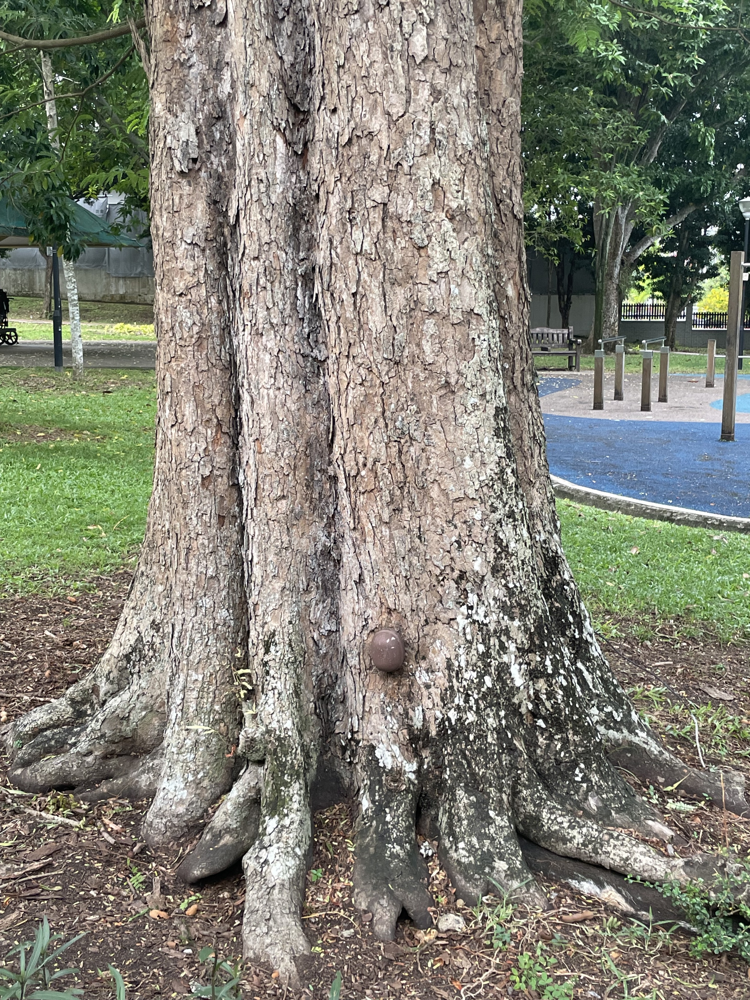

When I first moved to Singapore, I kept noticing things about its trees that did not make sense to me.

Singapore calls itself a City in Nature.[^greenplan] Trees are everywhere: along roads, inside parks, outside shopping malls, around schools, and between HDB blocks.

But on ordinary walks, I kept seeing scenes that felt contradictory.

A large tree reduced to a stump.

A small device attached to a tree trunk.

A beautiful roadside tree pruned so hard that it almost looked wounded.

At first, I thought these were signs of poor maintenance.

It turned out they were closer to the opposite.

They were signs that a green city has to be managed as carefully as it is planted.

## 1. Why Remove A Tree That Looks Healthy?


*A stump beside a path. From the outside, the tree may have looked fine.*

The first time I saw a large tree cut down to a stump, my instinctive reaction was:

```text
What a waste.
```

The tree must have provided shade. It must have cooled the pavement. It must have held birds, insects, and all the small life that depends on mature trees.

So why remove it?

The important word is *looked*.

A tree can look healthy from the outside and still have hidden problems: internal decay, weakened roots, poor anchorage, disease, soil stress, construction damage, or an unstable lean. A passer-by sees the trunk and canopy. An arborist has to think about the whole structure.

In a forest, a falling tree is part of the ecosystem.

In a city, a falling tree may land on a road, playground, school, bus stop, car, or apartment block.

That changes the calculation.

Singapore's tree management is not only about keeping the city green. It is also about deciding when a tree has become a public-safety risk. A mature tree can weigh several tonnes. During tropical storms, strong wind and heavy rain increase the load on branches and crowns. If the roots or trunk are already compromised, the failure may look sudden to the public even though the risk had been building for years.

So the question is not simply:

```text
Is this tree beautiful?
```

It is also:

```text
If this tree fails, where will it fall?
```

That is a much harder question. It explains why a tree that looks valuable to a walker may still be removed after professional assessment.

It feels harsh because the loss is visible.

The accident that did not happen is invisible.

## 2. Why Is There A Sensor On The Tree?



*A small sensor mounted near the base of a mature tree. It turns a quiet tree into something the city can monitor over time.*

Later, I noticed another detail.

Some mature trees had small electronic devices attached to their trunks.

For a long time, I had no idea what they were.

I understand these as tree tilt sensors: devices used to monitor whether a tree is slowly changing its angle over time.

That idea changed how I saw the city.

A leaning tree does not always fail suddenly. Sometimes the important signal is gradual: a tiny change in angle, repeated over time, before the problem becomes obvious to the human eye.

The sensor does not replace arborists. It gives them another signal.

Instead of waiting for visible damage, the system can watch for movement. Instead of treating all trees as equally urgent, arborists can focus attention on trees that show signs of instability.

I like this idea because it makes the city feel less like a static landscape and more like a monitored living system.

It is almost like giving important trees a smartwatch.

That sounds funny, but the principle is serious:

```text
Urban nature is not unmanaged nature.
It is living infrastructure.
```

When a city has many trees near people, roads, and buildings, inspection alone is not enough. The more mature and valuable the tree, the more important it becomes to detect risk early.

## 3. Why Prune Trees So Aggressively?

> Photo placeholder: arborists pruning a mature urban tree. Replace with an original or properly licensed image before public release.

*Tree pruning can look destructive from the street, especially when large limbs are removed.*

The third thing that surprised me was pruning.

Sometimes a tree is pruned so heavily that it almost looks damaged. As someone who enjoys walking under shade, I used to wonder:

```text
Why would anyone do this?
```

Again, the answer comes back to structure and risk.

A large crown is beautiful, but it is also a sail. During a storm, dense branches catch wind. After heavy rain, branches and leaves hold more weight. Dead limbs, weak forks, overextended branches, and unbalanced crowns all increase the chance that something breaks.

Pruning is not only cosmetic.

Done properly, it can remove dead or weak branches, reduce excess crown weight, improve clearance, rebalance the tree, and reduce the wind load on vulnerable parts of the structure.

From the ground, the result may look too severe.

From a risk-management point of view, the goal is different:

```text
Not to make the tree look perfect today,
but to help it survive the next storm.
```

This is the part I had not understood before.

Tree care in a dense city is not just gardening. It is engineering, biology, maintenance, and public safety combined.

## A Different Way Of Thinking

Before living in Singapore, I thought a green city simply meant planting more trees.

Now I think it means something harder.

A green city has to know which trees to protect, which trees to monitor, which trees to prune, and sometimes which trees to remove.

Singapore's Green Plan includes the ambition to plant one million more trees.[^greenplan] NParks also maintains public tree-related resources such as TreesSG, an interactive map for exploring trees in Singapore.[^nparks]

But planting is only the visible part.

The less visible part is maintenance: inspection, sensing, pruning, replacement, and risk decisions that most people only notice when something looks wrong.

That is the paradox I learned from these three trees.

The stump, the sensor, and the pruning machine all looked like interruptions in a City in Nature.

But they may be part of what allows the city to stay that way.

Sometimes, the most interesting things about a place are not the skyline or the famous attractions.

They are the small details you walk past every day without knowing how much system is behind them.

[^greenplan]: [Singapore Green Plan 2030](https://www.greenplan.gov.sg/) describes "City in Nature" as one of the Green Plan's pillars and lists "Plant 1 million more trees" as one of its key targets.
[^nparks]: [NParks](https://www.nparks.gov.sg/) links to TreesSG as an interactive map for exploring trees in Singapore.
