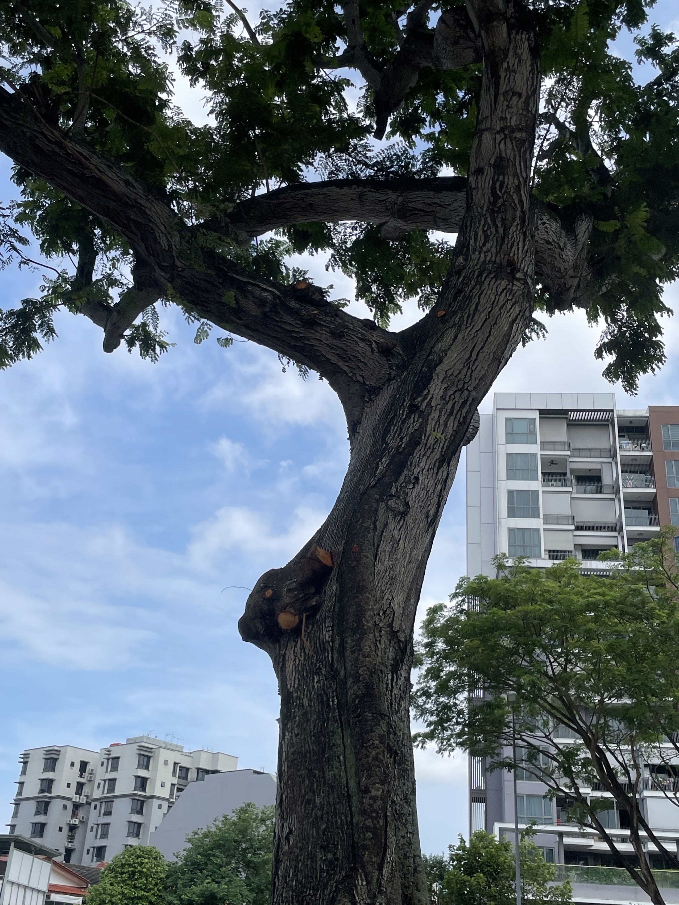

当我第一次搬到新加坡时，我对这里的树木管理有些困惑。

新加坡称自己为“自然中的城市”。[^greenplan] 无处不在的树木：公路旁、公园里、商场外、学校周围以及组屋之间。

但在日常的散步中，我常看到一些感觉矛盾的景象。

一棵被砍成树桩的大树。

一个小装置贴在树干上。

一棵美丽的路边树被修剪得几乎看起来受了伤。

起初，我以为这些是维护不善的表现。

后来我发现，事实恰恰相反。

它们显示了一个绿色城市需要像栽种一样谨慎地管理。

## 1. 为什么要移除看似健康的树？


*小径旁的树桩。从外观上看，这棵树可能看起来很好。*

第一次看到一棵大树被砍成树桩时，我本能的反应是：

```text
What a waste.
```

这棵树一定提供了阴凉。它一定为小路降温。它一定承载着鸟儿、昆虫以及所有依赖成熟树木的小生命。

那么，为什么要移除它？

关键字是 *看似*。

一棵树从外面看可能很健康，但仍然存在隐藏问题：内部腐烂、根部松动、固定不良、疾病、土壤应力、建筑损伤，或是不稳定的倾斜。路人看到的是树干和树冠，而树艺师则必须考虑整个结构。

在森林中，倒下的树是生态系统的一部分。

但在城市中，倒下的树可能会落在道路、游乐场、学校、公交站、汽车或公寓楼上。

这改变了衡量标准。

新加坡的树木管理不仅仅是保持城市绿色，还要决定何时一棵树已成为公共安全风险。一棵成熟的树可以重达数吨。在热带风暴中，强风和大雨增加了树枝和树冠的负担。如果树根或树干已经受损，尽管风险已积累多年，但对公众而言，这种失败可能看起来是突然的。

所以问题不仅仅是：

```text
Is this tree beautiful?
```

还有：

```text
If this tree fails, where will it fall?
```

这是一个更难的问题。这解释了为什么对行人来说看似有价值的树木在专业评估后仍可能被移除。

这种损失看起来很残酷，因为它是可见的。

而未发生的事故则是无形的。

## 2. 树上为什么有传感器？


*一个小传感器安装在成熟树的基部附近。它让一棵静静的树成为城市可以随时间监控的对象。*

后来，我注意到另一个细节。

一些成熟的树干上安装了小型电子设备。

很长一段时间，我不知道它们是什么。

我了解到这些是树倾斜传感器：用于监测树木是否随着时间的推移缓慢改变角度的设备。

这个理念改变了我看待城市的方式。

一棵倾斜的树并不总是突然倒下。有时重要的信号是逐步的：角度的微小变化，随着时间的推移，在问题变得明显之前反复出现。

传感器并不代替树艺师。它为他们提供了另一个信号。

系统可以在可见损坏发生前监控移动情况。树艺师可以将注意力集中在显示出不稳定迹象的树木上，而不是将所有树木视为同样紧急。

我喜欢这个想法，因为它让城市感觉不像一个静态的景观，而更像一个被监控的活生生的系统。

这几乎像是给重要的树木戴上了智能手表。

这听起来很有趣，但原则是严肃的：

```text
Urban nature is not unmanaged nature.
It is living infrastructure.
```

当一个城市有许多树木靠近人群、道路和建筑时，仅靠检查是不够的。树木越成熟、越有价值，及早检测风险就越重要。

## 3. 为什么要如此激烈地修剪树木？



*从地面上看，树木的修剪可能显得过于猛烈。缺失的树枝一目了然，但风险的减少却不易察觉。*

第三件让我惊讶的是修剪。

有时一棵树被修剪得如此严重，以至于几乎看起来受到了损害。作为一个喜欢在阴凉处走路的人，我常常想：

```text
Why would anyone do this?
```

答案再次回到结构和风险。

一个大的树冠很美，但它也是一个帆。在风暴中，密集的树枝会迎风。大雨过后，树枝和树叶会承载更多的重量。枯死的树枝、薄弱的分杈、过长的树枝和不平衡的树冠都增加了树木断裂的可能性。

修剪不仅仅是为了美观。

正确的修剪可以去除枯死或薄弱的树枝，减少过重的树冠重量，改善空隙，重新平衡树木，减少对结构脆弱部分的风载。

从地面上看，结果可能显得过于猛烈。

从风险管理的角度来看，目标是不同的：

```text
Not to make the tree look perfect today,
but to help it survive the next storm.
```

这是我之前没有理解的部分。

在密集的城市中，树木护理不仅仅是园艺。它是工程学、生物学、维护和公共安全的结合。

## 一种不同的思维方式

在住到新加坡之前，我以为绿色城市只是意味着种更多的树。

现在我认为，这意味着更艰难的事情。

一个绿色城市必须知道保护哪些树，监控哪些树，修剪哪些树，有时还要移除哪些树。

新加坡的绿色计划包括种植一百万棵新树的目标。[^greenplan] NParks还维护着公众可用的树木相关资源，如TreesSG，一个探索新加坡树木的互动地图。[^nparks]

但种植只是可见的部分。

不太可见的部分是维护：检查、感测、修剪、更替和风险决策，大多数人只有在某些东西看起来出错时才会注意到。

这是我从这三棵树中学到的悖论。

树桩、传感器和修剪机似乎是“自然中的城市”中的中断。

但它们可能是让城市保持那样的部分原因。

有时候，一个地方最有趣的东西不是天际线或著名的景点。

而是那些你每天走过时不知道背后有多少系统的小细节。

[^greenplan]: [新加坡绿色计划2030](https://www.greenplan.gov.sg/)将“自然中的城市”描述为绿色计划的支柱之一，并列出“再种植100万棵树”作为其关键目标之一。
[^nparks]: [NParks](https://www.nparks.gov.sg/)提供访问TreesSG的链接，这是一个探索新加坡树木的互动地图。
