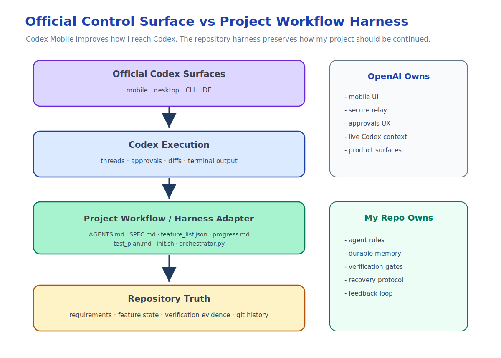

This is Part 5 of the Remote Agent Workflow series.

When I started this remote AI development setup, the problem was practical.

I wanted to keep local Codex work moving when I was away from my Mac.

That led to the first layer:

```text
Phone -> Tailscale -> SSH -> Mac -> tmux -> Codex
```

Then I realized mobile SSH was not the right daily interface, so I built a Telegram control plane:

```text
Phone -> Telegram Bot -> local Codex runtime -> selected repository
```

Then I reached the deeper rule:

```text
In the repository, not in the chat.
```

The repository has to hold durable project memory.

More precisely, the repository has to become the project's memory, operating contract, and feedback harness.

At this point, an obvious question appears:

```text
If official Codex Mobile exists, does a custom remote agent workflow still matter?
```

My answer is yes, but the reason changes.

The value is no longer just remote access.

The value is project-side workflow adaptation.

## What Codex Mobile Solves

OpenAI announced Codex in the ChatGPT mobile app in preview on May 14, 2026.

The official mobile experience lets you stay connected to Codex work from a phone. According to OpenAI, from mobile you can work across threads, review outputs, approve commands, change models, start new work, and receive live updates such as terminal output, diffs, test results, screenshots, and approvals.

OpenAI also describes a secure relay layer that keeps trusted machines reachable across devices without exposing them directly to the public internet.

That is important.

It means the official product now covers a large part of the remote control problem.

The thing I was trying to approximate with:

```text
Telegram Mobile
  -> Telegram Server
  -> local polling bot
  -> Codex runtime
```

now has an official shape:

```text
ChatGPT Mobile
  -> secure Codex relay
  -> trusted machine
  -> Codex app/runtime
```

For many people, that is the right answer.

It is integrated.

It understands Codex threads.

It supports approvals.

It shows live context from the machine where Codex is working.

It removes a lot of glue code.

That is a good thing.

## What My Telegram Bot Was Really Teaching Me

Looking back, the Telegram bot was not only a tool.

It was a prototype of a control plane.

It forced me to separate layers:

- mobile interface
- authorization
- repository selection
- task execution
- runtime logs
- session binding
- approval forwarding
- project memory

Some of those layers are better handled by the official Codex mobile experience.

For example:

- connecting to active Codex work
- seeing live thread context
- reviewing outputs
- approving commands
- switching across threads or hosts
- keeping the mobile UI aligned with Codex internals

I do not need to rebuild those if the official tool handles them well.

But the bot also exposed a second set of problems that official remote control does not automatically solve.

Those problems are specific to my repository harness.

## The Official App Is a Control Surface

Codex Mobile is a better control surface for Codex.

That is its strength.

It answers:

- How do I stay connected to active Codex threads?
- How do I approve an action from my phone?
- How do I review output while away from my desk?
- How do I start or continue work on a trusted machine?

Those are the right product questions for a general Codex mobile app.

But my workflow has another set of questions:

- What should every new agent session read before acting?
- How should a new requirement become durable?
- How do I prevent an agent from treating chat history as memory?
- How do I map work to stable feature IDs?
- How do I record verification evidence?
- Which command defines repository health?
- When is a feature allowed to become done?
- How do I recover after an interrupted run?

Those are not only Codex UI questions.

They are project workflow and harness questions.

## The Custom Layer Becomes a Workflow Adapter

This is the distinction I care about:

```text
Official Codex Mobile is the control surface.
My custom system is the project-side workflow adapter.
```



The control surface helps me interact with Codex.

The workflow adapter helps Codex interact with my project correctly.

It is also a harness adapter: it gives Codex the rules, memory, checks, and feedback loop that belong to this repository.

For me, that means the repository still contains files like:

- `AGENTS.md`
- `SPEC.md`
- `feature_list.json`
- `progress.md`
- `test_plan.md`
- `init.sh`
- `orchestrator.py`
- git history

Those files describe how I want long-running agent work to behave.

They are not a replacement for Codex Mobile.

They are the project-side protocol and harness that Codex should follow.

## Repository Memory and Harness Still Matter

Official mobile control does not change the core rule:

> The chat is for instructions.  
> The repository is for memory.

Even if the phone interface is excellent, I still do not want project truth to live only in a thread.

The repository still needs to be the agent's memory, operating contract, and feedback harness.

The repository should still answer:

- what the product is supposed to do
- what has already been completed
- what is blocked
- what failed before
- what tests cover completed work
- what the next agent should read
- what command proves the project is healthy

This matters even more when mobile control becomes easier.

If it becomes easy to start work from anywhere, it also becomes easy to create scattered, under-specified tasks.

Repository memory and harness rules are the counterweight.

It keeps mobile convenience from turning into workflow drift.

## My Bot May Become Less Important

The Telegram bot may become less central.

That is fine.

It was useful because it gave me:

- polling without public inbound access
- a constrained command surface
- repo whitelist selection
- task records
- local logs
- Codex session binding experiments
- approval forwarding experiments

But if official Codex Mobile handles remote access, live context, approvals, and thread control better, I should use the official tool for those jobs.

The point is not to keep custom infrastructure alive for its own sake.

The point is to keep the workflow principles that the custom infrastructure revealed.

## What I Would Keep

Even with Codex Mobile, I would keep:

- repository-level agent rules
- durable specs
- structured feature lists
- progress notes
- verification plans
- one-command health checks
- manual verification checklists where automation cannot cover behavior
- clear separation between runtime state and project state
- feedback loops that turn failures into better repo rules, scripts, and checks

I would also keep the idea of a bounded loop:

```text
read project state
select one unit of work
implement it
verify it independently
record the result
commit the change
```

Whether that loop is triggered from a terminal, Telegram, Codex Mobile, or the desktop app is less important.

The important thing is that the loop is recoverable.

## What I Would Stop Owning

I would prefer not to own:

- generic mobile UI
- live Codex thread rendering
- command approval UX
- secure cross-device relay
- host connection management
- model switching UI
- raw terminal or diff streaming

Those are product surface problems.

OpenAI is in a better position to solve them inside Codex.

My custom layer should stay closer to the project:

```text
How should this repository guide agent work?
```

not:

```text
How do I rebuild a mobile Codex client?
```

That is the line.

## How I Think About the Stack Now

The stack now looks like this:

```text
Official Codex surfaces
  -> mobile, desktop, CLI, IDE

Project workflow / harness adapter
  -> AGENTS.md, SPEC.md, feature_list.json, progress.md, test_plan.md, init.sh

Execution loop
  -> Codex, orchestrator, evaluator, tests

Durable memory
  -> repository files and git history
```

The official surfaces make Codex easier to reach.

The workflow adapter makes the project easier to continue.

The harness makes the work easier to verify and improve.

Those are complementary.

## This Is Not About Competing With Codex

It would be the wrong lesson to say:

```text
Official Codex Mobile exists, so custom workflows are obsolete.
```

It would also be the wrong lesson to say:

```text
I built a Telegram bot, so I do not need the official app.
```

The better lesson is:

```text
Use official tools for the generic control surface.
Use repository-level workflow rules for project-specific continuity.
```

The official product can make remote Codex control much better.

My repository workflow can make long-running agent work more recoverable.

My repository harness can make agent failures feed back into better project rules, tools, and checks.

Those solve different parts of the problem.

## The Final Shape

The series started with a terminal problem.

But it did not end there.

The actual progression was:

```text
Remote terminal
  -> remote runtime
  -> mobile control plane
  -> repository memory
  -> repository harness
  -> workflow adapter
```

That final layer is the part I still care about after Codex Mobile.

Not because I want to rebuild Codex.

Because I want Codex to operate inside a workflow that matches how I build software.

The phone can be official.

The agent can be Codex.

The control surface can improve over time.

But the project still needs its own memory, rules, verification, and history.

That belongs in the repository.

## Sources

- [Work with Codex from anywhere](https://openai.com/index/work-with-codex-from-anywhere/)
- [Introducing the Codex app](https://openai.com/index/introducing-the-codex-app/)
- [Running Codex safely at OpenAI](https://openai.com/index/running-codex-safely/)

## Remote Agent Workflow Series

Series index: [Remote Agent Workflow](/posts/remote-agent-workflow/)

Previous: [In the Repository, Not in the Chat](/posts/in-the-repository-not-in-the-chat/)
