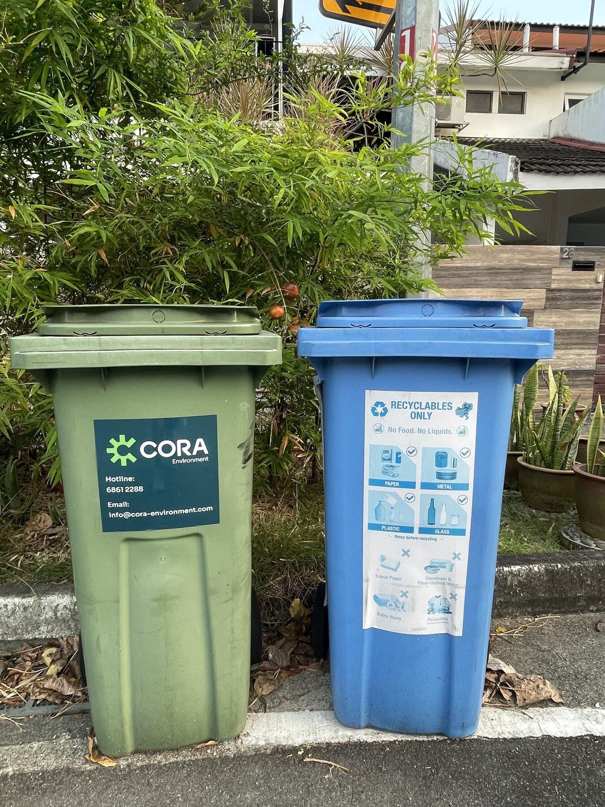
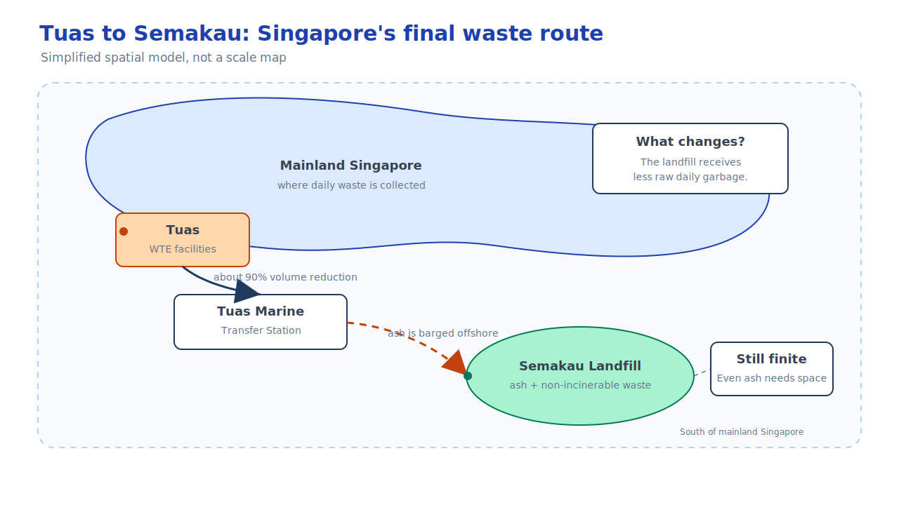
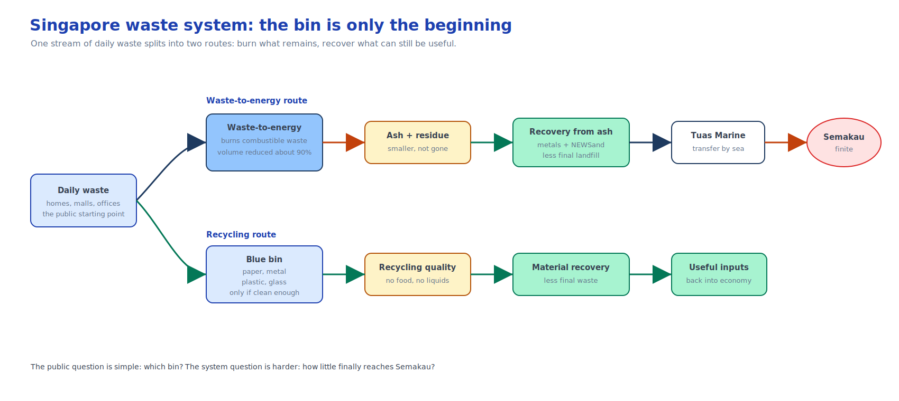
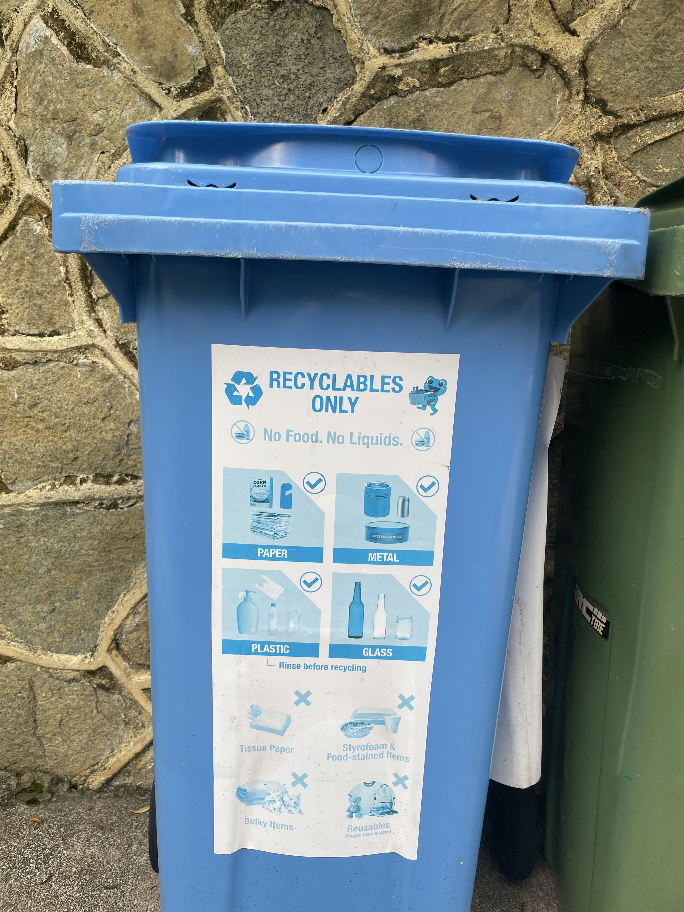

Recently, a strange phrase started appearing in discussions about waste in China:

```text
There is not enough garbage to burn.
```

At first, it sounds impossible.

For many years, Chinese cities were associated with the opposite problem: too much garbage, not enough places to put it, and the fear of "waste besieging the city."

So how can a country move from too much garbage to not enough garbage?

The answer is not that garbage has disappeared.

It is that the waste-treatment system has changed.

Over the past decade, many Chinese cities expanded waste-to-energy incineration capacity at enormous speed. In some places, the new problem is no longer whether the city can process its municipal waste. It is whether the incineration plants have enough waste to operate at the scale they were built for.

That is why the phrase is interesting.

It is not just a story about garbage.

It is a signal that a city has moved from one stage of waste management to another.

## Incineration Is Not Mainly About Electricity

When people hear "waste-to-energy," it is easy to think the main point is electricity.

That is part of the story, but not the deepest part.

The real pressure behind incineration is land.

Traditional landfills are difficult to sustain in dense cities. They occupy land for a long time. They generate leachate that must be managed carefully. They produce landfill gas. Even after closure, a landfill may need monitoring and maintenance for decades.

Incineration changes the shape of the problem.

Instead of burying large volumes of mixed waste directly into the ground, a city can burn combustible waste in controlled facilities, recover some energy, reduce the volume dramatically, and concentrate the remaining material into ash and residues.

In Singapore's official explanation, incineration reduces waste volume by about 90 percent.[^nea-wte]

That number is the key.

The value of incineration is not that it makes waste vanish.

It compresses the problem.

```text
A large amount of daily waste -> a much smaller amount of ash and residue
```

But compression is not disappearance.

After incineration, something is still left behind.

And that is where Singapore becomes interesting.

## Singapore Has Been Living In The Next Stage For Years

Singapore is a useful example because it cannot treat land as an unlimited buffer.

The country is small. Its population is dense. Its economy is urban. A large landfill-based system would create a direct conflict with land use, housing, industry, ports, nature, and water management.

So Singapore built a system where most combustible waste goes to waste-to-energy incineration plants. Metals can be recovered from incineration bottom ash. The remaining ash, together with non-incinerable waste, is sent to Semakau Landfill, Singapore's offshore landfill.[^nea-semakau]

This is the part that changes the mental model.

For a resident, waste management seems to end at the rubbish chute or the bin centre.

For the city, that is only the beginning.

```text
Flat / shop / office
  -> bin centre or collection point
  -> waste collection truck
  -> waste-to-energy plant
  -> ash and residues
  -> Tuas Marine Transfer Station
  -> Semakau Landfill
```

The ordinary rubbish bin is just the front door of a national logistics system.



*Two ordinary bins, two different routes. The city-scale system begins with this small split between general waste and clean recyclables.*

## The City Does Not Transport Only Garbage

One tempting way to describe the contrast is:

```text
Some cities transport garbage. Singapore transports ash.
```

That sentence is memorable, but it needs to be understood carefully.

Singapore still collects and transports daily waste. Trucks still move rubbish from homes, malls, food courts, offices, and public spaces.

The difference is what reaches the final landfill.

In a landfill-first system, much more original waste goes directly into the ground.

In Singapore's system, the final landfill mainly receives the smaller remainder after incineration: ash, residues, and non-incinerable waste.

That is a very different problem.

The city is no longer asking only:

```text
Where do we put all this garbage?
```

It is asking:

```text
After we reduce waste by burning it, what do we do with what remains?
```

This is the next stage of waste management.

## Semakau Is Not Just A Landfill. It Is A Countdown.

Semakau Landfill is easy to misunderstand.

From far away, people may imagine it as a growing island of raw garbage.

But Semakau is not simply a place where loose household rubbish is dumped into the sea. It is an engineered offshore landfill. Waste that has already been incinerated is transported by sea and placed within a contained landfill area.

That makes it cleaner and more controlled than the mental image many people have of a landfill.

But it does not make the capacity problem disappear.

Semakau still has a limit.

Every tonne of ash that enters Semakau uses part of Singapore's final landfill capacity. Even if incineration reduces waste volume by 90 percent, the remaining 10 percent matters when land is scarce.

This is why Semakau is not only the end of the waste system.

It is also a clock.

As long as the city keeps producing waste, the landfill keeps filling.



*A simplified route model, not a scale map. The important idea is the sequence: incineration in Tuas, marine transfer, then final disposal at Semakau.*

## The Future Is Not More Burning

Once a city becomes good at incineration, the next question is not simply how to build more incinerators.

The harder question is how to reduce what remains after incineration.

Singapore's future waste strategy points in that direction.

One example is NEWSand, Singapore's effort to explore whether treated incineration bottom ash and other waste residues can be used as construction material, such as in roads or non-structural applications.[^nea-newsand]

The idea is simple but important:

```text
If ash can safely become material, less ash needs to become landfill.
```

That does not mean every residue can be reused casually. Safety standards matter. Heavy metals, leaching risks, and long-term environmental effects must be controlled.

But the direction is clear.

The next stage is not just waste treatment.

It is material recovery.

The city starts to ask whether something currently treated as "waste" can be turned back into a usable input.

## Tuas Nexus: Waste, Water, And Energy In One System

Another part of Singapore's future is Tuas Nexus.

Tuas Nexus brings together the Integrated Waste Management Facility and the Tuas Water Reclamation Plant. The important idea is co-location: waste management and used-water treatment are planned together so that energy and resource flows can support each other.[^nea-iwmf]

This matters because a city does not have separate problems called "waste," "water," and "energy."

It has one metabolism.

Food becomes waste.

Used water becomes sludge.

Waste can produce energy.

Recovered materials can re-enter construction or industry.

The more integrated the system becomes, the less each stream is treated as an isolated problem.

That is a different way to see infrastructure.

Not as separate plants, but as connected organs in a city.



*The bin is only the first interface. After that, the city decides what can be burned, recovered, reused, or finally sent to Semakau.*

## Recycling Is The Harder Everyday Part

There is one more reason the rubbish bin matters.

Industrial systems can be engineered, but recycling quality starts with everyday behavior.

Singapore has blue recycling bins across many neighborhoods. They are visible, familiar, and easy to ignore.

But the real question is not whether a recycling bin exists.

The real question is what goes into it.



*The instruction label is doing a lot of work: recyclables only, no food, no liquids, and rinse before recycling.*

If recyclables are contaminated with food, liquid, or non-recyclable items, the material becomes harder or impossible to recover. A recycling bin can look like progress from the outside while still producing low-quality material inside.

This is why the future of waste management is not only about big facilities in Tuas.

It is also about the small decision made downstairs:

```text
Is this bottle empty?
Is this container clean?
Is this item actually recyclable?
Should this go into the blue bin or the normal bin?
```

The city can build the system.

Residents still decide what enters it.

The label on the bin is a small piece of public infrastructure. It has to translate a national recycling system into a few choices that a person can make in five seconds.

## What The Phrase Really Means

So what does "not enough garbage to burn" really tell us?

It tells us that waste management has stages.

The first stage is survival:

```text
Collect the waste.
Keep streets clean.
Stop garbage from piling up.
```

The second stage is controlled treatment:

```text
Move away from uncontrolled dumping.
Reduce reliance on landfills.
Use incineration or other systems to process waste safely.
```

The third stage is resource recovery:

```text
Recover metals.
Recover energy.
Recover materials.
Reduce the final residue.
Protect the last landfill capacity.
```

China's "not enough garbage to burn" moment is interesting because it shows how quickly a system can move from shortage of treatment capacity to possible overcapacity in some places.

Singapore is interesting because it has already been living with the question that comes after incineration:

```text
What do we do with the things that are left?
```

## The Hidden System Under The Bin

Before thinking about this topic, I saw rubbish bins as the end of a process.

You throw something away.

The lid closes.

It is gone.

But the city does not have an "away."

There is only another place in the system.

The bin leads to a truck.

The truck leads to a plant.

The plant leads to ash.

The ash leads to Semakau.

And Semakau leads to a bigger question:

```text
Can a city keep making less final waste, even while people keep living, eating, buying, and throwing things away?
```

That is why waste management is a good topic for a city series.

It starts with something ordinary enough to walk past every day.

Then it reveals the hidden machinery that allows a dense city to function.

The more I look at Singapore, the more I feel that its most interesting systems are not always the most visible ones.

Sometimes they begin with a tree stump.

Sometimes they begin with a rubbish bin.

[^nea-wte]: NEA explains that Singapore's waste-to-energy incineration plants reduce waste volume by about 90 percent before the remaining ash is sent for disposal. See [Waste-To-Energy Incineration Plants](https://www.nea.gov.sg/our-services/waste-management/waste-management-infrastructure/semakau-landfill/waste-to-energy-and-incineration-plants).
[^nea-semakau]: NEA describes Semakau Landfill as Singapore's offshore landfill for incineration ash and non-incinerable waste. See [Semakau Landfill](https://www.nea.gov.sg/our-services/waste-management/waste-management-infrastructure/semakau-landfill).
[^nea-newsand]: NEA's NEWSand work explores the use of treated waste residues, including incineration bottom ash, as construction material under environmental standards. See [Provisional Environmental Standards for NEWSand](https://www.nea.gov.sg/our-services/waste-management/provisional-environmental-standards-for-newsand).
[^nea-iwmf]: NEA describes the Integrated Waste Management Facility as part of Tuas Nexus, co-located with PUB's Tuas Water Reclamation Plant. See [Integrated Waste Management Facility](https://www.nea.gov.sg/our-services/waste-management/waste-management-infrastructure/integrated-waste-management-facility).
