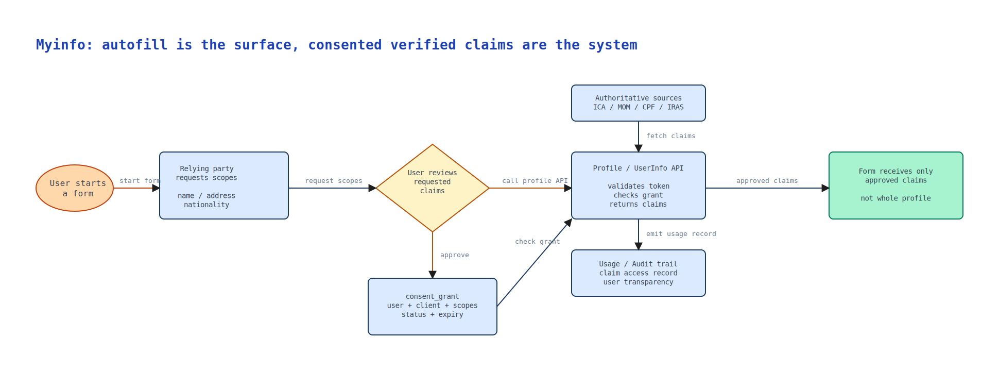

A form asks for your name, address, nationality, contact details, income information, or family records. You have filled in some version of this form before. The service may also ask for documents, then someone or some backend process has to verify that the documents match what you typed.

Then a button appears:

```text
Retrieve Myinfo
```

From the user's point of view, this looks like autofill.

That is true, but incomplete. Autofill saves typing. Myinfo does something more important:

```text
Myinfo moves verified claims with consent.
```

That is why it belongs in the same trust infrastructure story as Singpass QR login. 

QR login answers: "How do I prove I am me?" 

Myinfo answers: "How do I let this service use specific trusted facts about me?"



This familiar profile view is the user-facing intuition: personal details are grouped into recognizable categories. Myinfo becomes important when a service is allowed to retrieve specific verified claims from those categories with consent.



## Authentication Does Not Move Facts

Authentication tells a service who the user is. Many workflows need more than that.

A bank may need identity and residency details. An insurance workflow may need demographic and contact information. A government application may need family, employment, or benefit-related data. If Singpass only says "this user logged in", the user still has to fill in the rest, upload documents, and wait for verification.

The deeper problem is duplicated verification. Without a trusted data-sharing layer, every relying party becomes a small identity-verification system: it collects documents, stores copies, checks them, handles errors, and carries data risk.

Myinfo exists because verified personal data is also shared infrastructure.

## What The User Actually Sees

The useful intuition is a form with two kinds of fields.

After the user clicks "Retrieve Myinfo", some fields are filled from approved sources and should be shown as retrieved data. Other fields are still normal user input.

| Field on the form | What changes after Retrieve Myinfo | Why it matters |
| --- | --- | --- |
| Legal name, date of birth, nationality, registered address | Retrieved from approved government or participating sources, then displayed as-is | The service can treat these as verified claims instead of freshly typed text |
| CPF contribution history, notice of assessment, family or vehicle records | Retrieved only if the relying party is approved to request them and the user consents | Sensitive facts move by scope and purpose, not as a whole profile dump |
| Email, preferred contact time, delivery instruction, marketing preference | Still entered or edited by the user | Not every field needs government authority; some fields are just preferences |
| Missing or outdated source data | The user may need to update the source agency or choose a non-Myinfo path | The form should not silently turn source-derived data into arbitrary editable text |

So the experience is not simply "the form got filled faster". The form now contains a mixture of verified claims, user-provided details, and policy decisions about what the service is allowed to receive.

## Claims, Not Whole Profiles

The useful unit is not "profile". It is "claim".

A claim is one specific fact about a person:

```text
name
registered_address
nationality
mobile_number
notice_of_assessment
cpf_contribution_history
family_record
vehicle_record
```

Not every service needs every claim. A simple registration flow may need name and contact details. A financial product may need income-related data. A vehicle-related service may need driving or vehicle records.

This is why scopes matter. Scopes are not just API configuration. They are policy boundaries: what the relying party can request, what the user can approve, and what the platform may return.

The better question is not:

```text
What data could this service use?
```

It is:

```text
What data does this service need for this specific purpose?
```

That distinction prevents Myinfo from becoming an unrestricted data pipe.

## Consent Is A Record, Not A Checkbox

Consent has a user-facing side and a backend side.

The user should see who is asking, which fields are being requested, and what the request is for. The backend should record something more structured than "the user clicked OK":

```text
consent_grant {
  user_id
  client_id
  purpose
  approved_scopes
  status
  created_at
  expires_at
}
```

The exact schema can vary, but the platform must be able to answer later:

```text
Did this user allow this relying party
to access these claims
for this purpose at this time?
```

That is the difference between convenient autofill and accountable data sharing.

## Source Authority Changes The Workflow

If a user types an address into a form, the service receives user-entered text. It may be correct, but the service still has to decide how much to trust it.

If the service receives an approved claim through Myinfo, the trust model changes. The data may still need freshness checks and policy context, but it is no longer just free-form input. It can come from participating authoritative sources or a verified cache.

That changes operations. Instead of asking for a document upload and manually checking it, the service can receive the relevant claim directly, if the user consents and the service is approved to request it.

This reduces repeated typing, document uploads, inconsistent entries, and duplicated storage of sensitive documents. It also creates a stronger obligation: the service should request only what it needs, use it only for the approved purpose, and avoid keeping data when a transaction is not completed.

## Why Displaying Data As-Is Matters

One Myinfo principle looks like a UI detail: retrieved data should be displayed as-is on the form.

It is more than UI.

If source-derived data is freely edited before submission, the service loses clarity about what is authoritative and what is user-provided. A better pattern is:

- government-originated data is displayed clearly
- authoritative fields are not silently changed downstream
- user-provided fields remain editable
- the user can see what was retrieved before submitting

This preserves the verification value of the data and makes the flow easier to audit.

## The Flow

A simplified Myinfo-style flow has two separate decisions:

1. Is the user authenticated?
2. Is this relying party allowed to access these claims with this user's consent?

The flow looks like this:

```text
User starts a form
  -> relying party requests scopes
  -> user reviews requested claims
  -> consent grant is recorded or checked
  -> Profile / UserInfo API validates token and grant
  -> approved claims are fetched from authoritative sources or cache
  -> only approved claims are returned
  -> usage is recorded for audit and user transparency
```

Authentication and data sharing should remain separate. A service may know who you are without being allowed to retrieve every fact about you.

## The Tradeoff

Myinfo is powerful because it reduces friction and improves data quality. It can make forms faster, reduce errors, and remove repeated document checks.

The risk is over-collection. If data sharing becomes too easy, relying parties may ask for more than they need, users may approve without reading, and sensitive data may spread downstream.

So the design cannot be "share everything faster". The better design is:

- authenticate strongly
- request narrowly
- show requested claims clearly
- consent explicitly
- return only approved claims
- preserve source authority
- audit sensitive access
- hold relying parties accountable

In one sentence:

```text
Myinfo is not autofill with better branding.
It is a consented channel for moving verified facts
between a resident, the state, and a relying service.
```

That is why it should be understood as trust infrastructure, not just convenience.

## References

- [Singpass Myinfo](https://docs.developer.singpass.gov.sg/docs/products/singpass-myinfo)
- [Myinfo Key Principles](https://docs.developer.singpass.gov.sg/docs/products/singpass-myinfo/key-principles)
- [Myinfo Data Catalog](https://docs.developer.singpass.gov.sg/docs/data-catalog-myinfo/catalog)
- [Understanding the basics of OIDC](https://docs.developer.singpass.gov.sg/docs/introduction/understanding-the-basics-of-oidc)
- [Singpass for Individuals](https://www.singpass.gov.sg/main/individuals/)
- [Singpass App on the Apple App Store](https://apps.apple.com/us/app/singpass/id1340660807)
