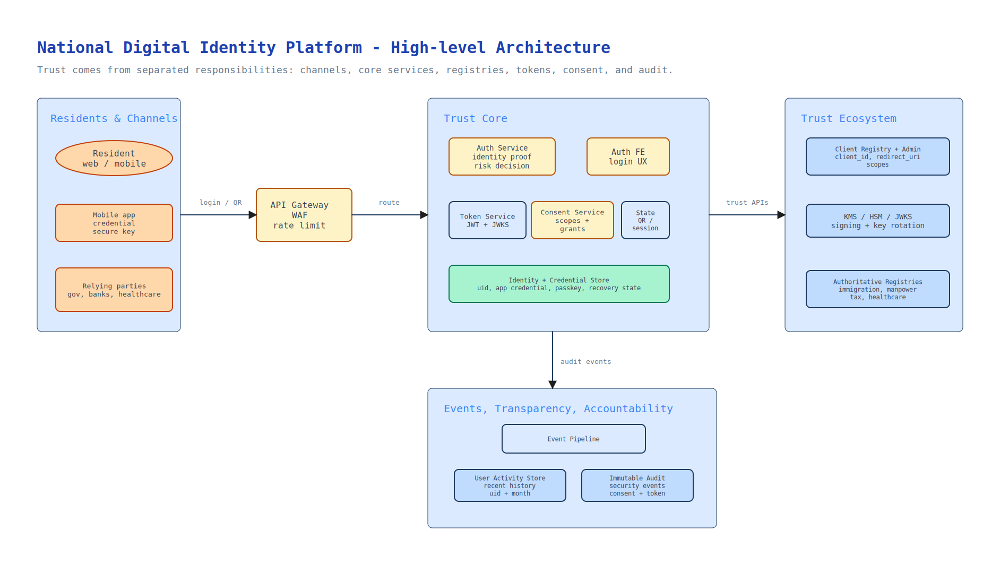

At first glance, Singpass looks like a login system.

You open a government website, click "Log in with Singpass", scan a QR code, approve it on your phone, and continue. From the user's point of view, the experience is simple. It feels like a national version of "Sign in with Google".

But if we design such a system from first principles, it quickly becomes clear that login is only the visible tip of the system.

The real problem is larger:

```text
How does a country let residents prove who they are,
let services trust that proof,
let data move with consent,
and keep the whole process secure and auditable?
```

Once we ask the question this way, a national digital identity platform stops being an authentication feature. It becomes public trust infrastructure.



The familiar app screen is a useful clue. Singpass is not only a place to log in; it is also becoming a trusted entry point into many public services.

## Start Without Singpass

Imagine Singpass does not exist.

Every government agency, bank, hospital, school, employer, and public service needs to know some version of the same thing:

- Who is this person?
- Is this really the person they claim to be?
- Is this person allowed to perform this action?
- Has the person consented to share these details?
- Can we prove later what happened?

Without a national identity platform, every organisation solves this problem separately.

Residents create many accounts. They remember many passwords. They upload identity documents again and again. They fill in the same personal details across different forms. Organisations build their own identity checks, store sensitive data, and invent separate recovery flows. The result is duplication, friction, and risk.

A national digital identity platform exists because identity is a shared problem.

## The First Primitive: Identity Anchor

The first building block is a stable identity anchor.

For every eligible resident, the platform needs a durable internal identity. This identity should not simply be the national ID number exposed everywhere. A better design is to use an internal user identifier and treat national identifiers as sensitive references to authoritative registries.

The platform should know enough to authenticate a person and represent their identity, but it should not become the owner of all government data.

That distinction matters.

A national identity platform should integrate with source-of-truth systems such as immigration, manpower, tax, pension, healthcare, and other public agencies. But it should not absorb all domain data into itself. Otherwise, it becomes a giant central database of everything, which increases blast radius, privacy risk, and governance complexity.

The identity platform should be the trust layer, not the owner of every fact.

## The Second Primitive: Authenticator

An identity anchor says that an identity exists. It does not prove that the current person using a browser or phone is the rightful owner of that identity.

That is the job of authenticators.

A national platform cannot rely only on passwords. Passwords are familiar, but they are phishable, reusable, and often weak. A serious identity platform needs multiple authentication methods with different assurance levels:

- password login for basic access
- mobile app credential for stronger authentication
- QR approval for cross-device login
- passkeys or device biometrics for passwordless authentication
- face verification for high-risk flows
- in-person recovery for users who lose access to their devices

The important design idea is not just "support more login methods". It is to model authentication strength.

Reading a low-risk page may need one level of assurance. Accessing healthcare data, signing a legal document, approving a bank transaction, or recovering an account should require a stronger level. This is where step-up authentication becomes necessary.

A mature identity platform does not ask "is the user logged in?" It asks "how strongly do we know this is the user, and is that strong enough for this action?"

## The Third Primitive: Federation

The platform is not useful if it only works on its own website.

The real power comes when other organisations can rely on it. A hospital, bank, school, employer, or government service should not need to build its own national-grade identity system. It should be able to redirect the user to the national identity platform, receive a trusted authentication result, and create its own session for that user.

This is identity federation.

In modern systems, this is usually built with standards such as OpenID Connect and OAuth-style flows. The identity platform becomes the identity provider. External services become relying parties.

To make this safe, the platform needs a developer and governance layer:

- client onboarding
- sandbox and production environments
- registered redirect URIs
- approved scopes
- signing keys and key rotation
- client authentication
- rate limits and monitoring
- suspension for abusive or compromised clients

This layer turns identity into infrastructure. It creates a controlled ecosystem where many services can trust the same authentication result without each service reinventing identity proofing.

## The Fourth Primitive: Consent And Verified Data

Login answers one question: "Who is this user?"

But many real services need more than that.

A bank may need name, address, and residency status. A healthcare service may need demographic details. A housing or benefits service may need family, income, or employment-related data. A school or employer may need verified personal information.

If the national platform stops at login, residents still need to fill in forms, upload PDFs, and repeatedly prove facts that the government already knows.

This is why consented data sharing naturally appears.

The platform should let a relying party request specific claims. The user should see what is being requested, who is asking, where the data comes from, and what it will be used for. If the user agrees, the platform creates a consent grant and returns only the approved data.

This turns the platform from "prove who I am" into "let me reuse verified facts about myself".

That is a major shift. It reduces paperwork, but it also raises privacy stakes. Consent must be explicit, scoped, auditable, and revocable where appropriate. The relying party should not receive more data than it needs.

## The Fifth Primitive: Digital Credentials And Signing

Once a platform can strongly authenticate a person, another question appears:

```text
Can the platform help this person prove identity
or approve actions outside a normal web login?
```

This leads to digital credentials.

A resident may need to prove identity in person. A digital ID can help. A person may need to sign a document. A signing credential can help. A user may need to approve a sensitive transaction. A transaction-signing flow can help.

These are not random product features. They are natural extensions of the same trust foundation.

If the platform can answer "this is really Alice" with high assurance, then it can also help answer:

- Alice was present.
- Alice saw these details.
- Alice approved this transaction.
- Alice signed this document.
- Alice did so at this time, using this assurance level.

At that point, the platform has moved far beyond login. It has become part of the country's digital legal and economic fabric.

## The Sixth Primitive: Audit And Governance

A national identity platform carries serious risk.

If an account is compromised, the attacker may access government services, private services, financial accounts, healthcare records, or legal workflows. If a relying party abuses data access, residents can be harmed at scale. If internal operators misuse privileges, the platform itself loses legitimacy.

So audit and governance are not add-ons. They are core design requirements.

The platform needs:

- user-visible activity history
- immutable security audit logs
- fraud and anomaly detection
- account suspension and recovery
- client suspension
- key rotation
- incident response workflows
- strict access control for internal tools
- data minimisation and retention policies

In an ordinary consumer app, some of these may be postponed. In national identity infrastructure, they belong near the center of the design.

Trust is not created by authentication alone. It is created by authentication plus accountability.

## The Architecture View

The primitives above can be seen as one layered architecture.



Resident and relying-party channels enter through the platform edge. Authentication, token issuance, consent, identity profile access, and audit are separated inside the trust core. Around that core sit the systems that make the platform governable: client registry, key management, authoritative registries, user-visible activity history, and immutable audit logs.

## Why The System Keeps Expanding

From first principles, the platform expands in a predictable sequence.

First, it solves login. Residents no longer need separate credentials for every government service.

Then it adds mobile authentication and QR login, because people increasingly start actions on one device and approve them on another.

Then it adds consented data sharing, because login alone does not eliminate repeated form filling and document uploads.

Then it adds digital ID and verification, because identity is needed offline and in hybrid situations, not only inside websites.

Then it adds document signing and transaction signing, because strong authentication naturally supports explicit approval of high-risk actions.

Then it becomes a broader resident life platform: notifications, reminders, financial data aggregation, benefit workflows, renewals, and other services that depend on trusted identity.

This expansion is not feature creep. It is the gravitational pull of identity infrastructure.

Once a platform becomes the trusted way to prove who someone is, many adjacent problems start orbiting it.

## Why Real Singpass Looks The Way It Does

This first-principles path also explains why real Singpass looks broader than a login product.

Public Singpass materials show a platform that includes national digital identity authentication, QR login, Digital IC, verification of personal details, Myinfo data sharing, document signing, transaction signing, notifications, and ecosystem integrations such as SGFinDex.

These can look like separate product features, but they are better read as different surfaces of the same trust infrastructure.

QR login extends authentication across devices. Myinfo extends identity into consented data sharing. Digital IC and verification extend identity into offline or hybrid contexts. Signing turns strong authentication into explicit approval. Notifications and ecosystem integrations make the platform part of everyday resident workflows.

So the breadth is not accidental. Once Singpass becomes the trusted way to prove identity, adjacent trust problems naturally attach to it.

```text
A national identity platform starts as login infrastructure
and evolves into trust infrastructure.
```

## The Design Tradeoff

This kind of platform is powerful, but power creates tension.

Centralising trust improves convenience, security consistency, and ecosystem adoption. It reduces duplicated identity checks and gives residents a common way to prove themselves.

But centralisation also increases the consequences of failure. A platform outage can block access to many services. A compromised account can have broad impact. Over-collection of data can harm privacy. Weak governance can damage public trust.

So the best design is not simply "put everything into one platform".

The better design is layered:

- centralise authentication and trust protocols
- decentralise authoritative domain data
- minimise stored personal data
- require consent for data sharing
- separate user-facing history from compliance audit logs
- make relying parties accountable
- build recovery and fallback paths for real residents

That balance is what makes a national identity platform hard and interesting.

It is not just a technical system. It is a civic system with software inside it.

## A Simple Mental Model

If I had to explain the whole thing in one sentence:

```text
A national digital identity platform lets residents prove who they are,
lets services trust that proof,
lets data move with consent,
and makes sensitive actions accountable.
```

That is why a login system does not remain a login system.

At national scale, login becomes identity.

Identity becomes consent.

Consent becomes data sharing.

Strong authentication becomes signing.

Activity history becomes accountability.

And the whole thing becomes trust infrastructure.

## References

- [Singpass for Individuals](https://www.singpass.gov.sg/main/individuals/)
- [Singpass Developer Docs](https://docs.developer.singpass.gov.sg/docs)
- [Overview of Singpass](https://docs.developer.singpass.gov.sg/docs/introduction/overview-of-singpass)
- [Understanding the basics of OIDC](https://docs.developer.singpass.gov.sg/docs/introduction/understanding-the-basics-of-oidc)
- [Singpass Myinfo](https://docs.developer.singpass.gov.sg/docs/products/singpass-myinfo)
- [Singpass App on the Apple App Store](https://apps.apple.com/us/app/singpass/id1340660807)
